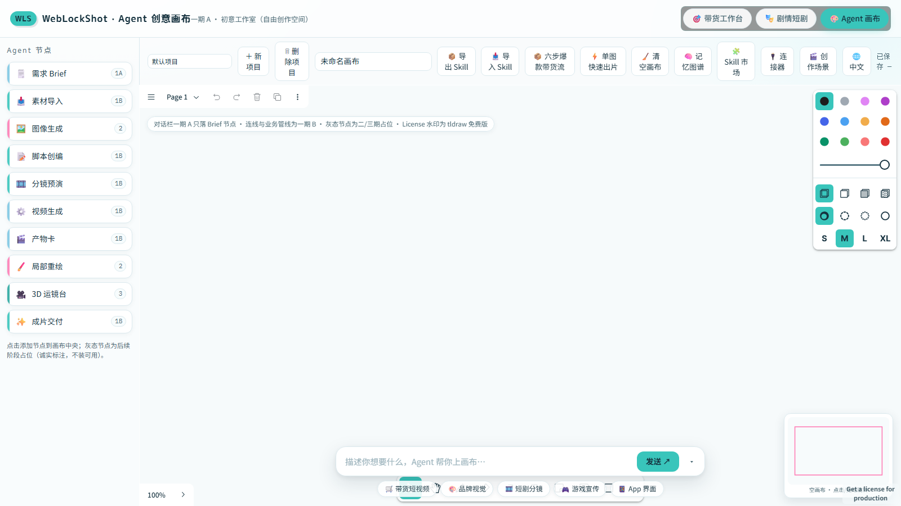
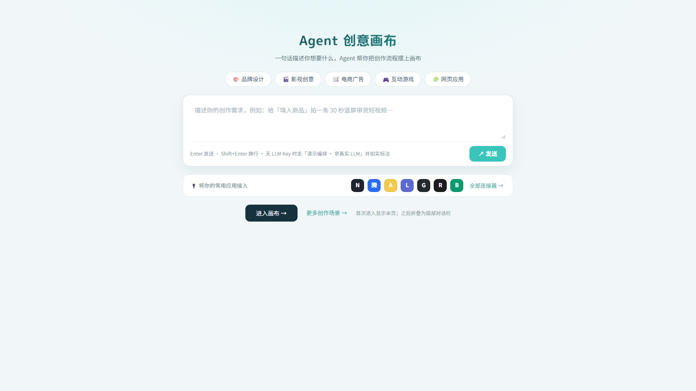
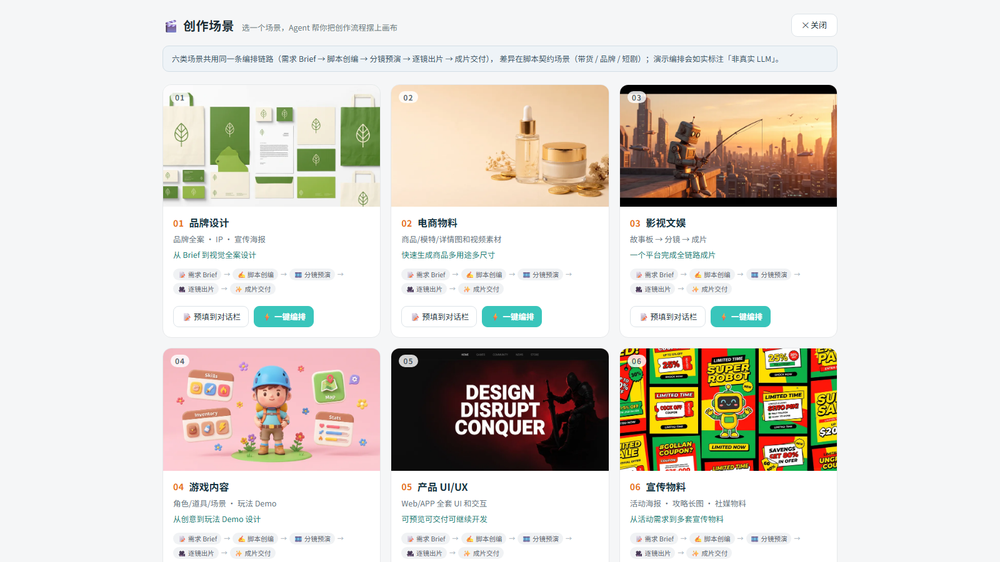
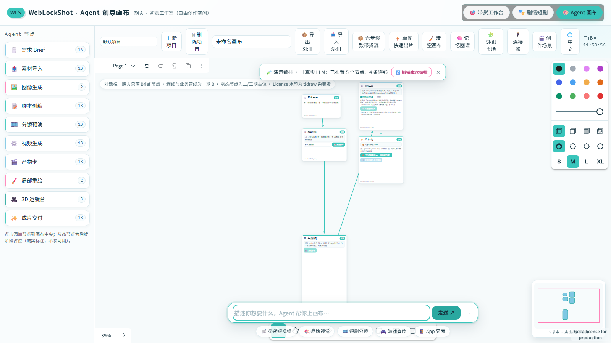
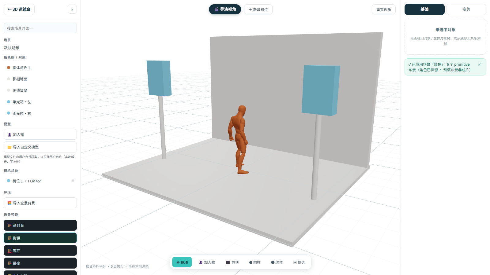
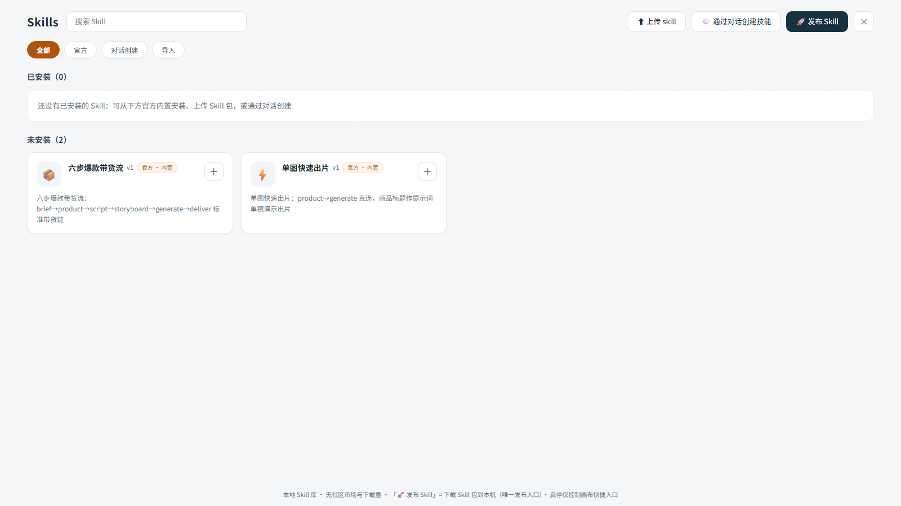
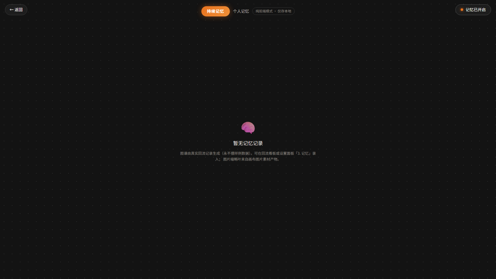
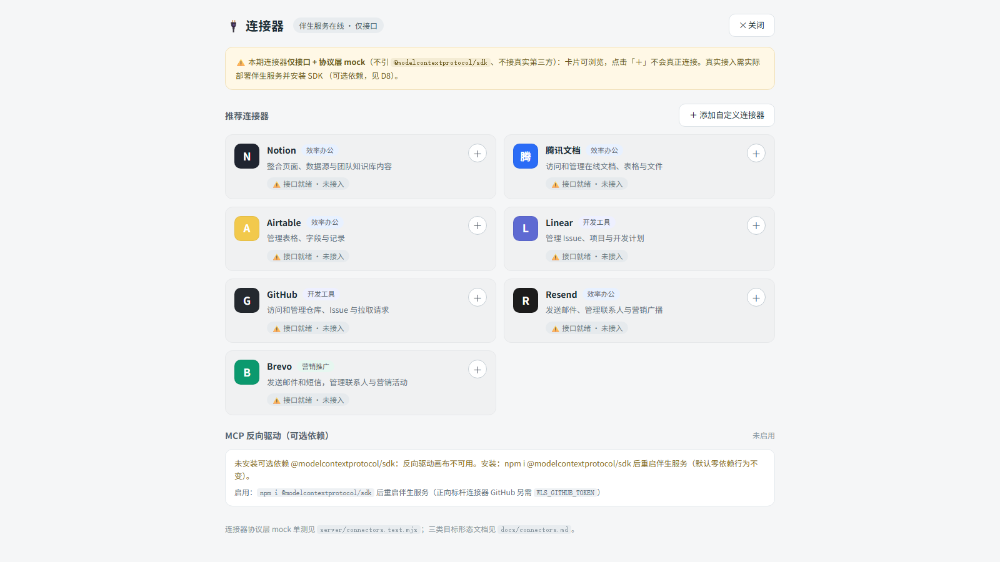
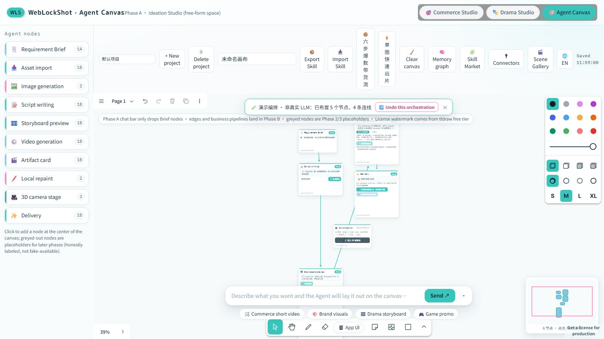

# 分册一 · Agent 创意画布（主线）

> 主手册：[HOW_TO_USE.md](./HOW_TO_USE.md) · 带货线分册：[HOW_TO_USE.commerce.md](./HOW_TO_USE.commerce.md)
> English: [HOW_TO_USE.canvas.en.md](./HOW_TO_USE.canvas.en.md)

---

## 目录

- [1. 进入画布](#1-进入画布)
- [2. 开场层与创作场景画廊](#2-开场层与创作场景画廊)
- [3. 对话栏编排（一句话上画布）](#3-对话栏编排一句话上画布)
- [4. 节点与数据流契约](#4-节点与数据流契约)
- [5. 出片：从脚本到产物卡](#5-出片从脚本到产物卡)
- [6. 指哪改哪：局部重绘与版本堆叠](#6-指哪改哪局部重绘与版本堆叠)
- [7. 3D 运镜台](#7-3d-运镜台)
- [8. Skill 沉淀 / 复用 / 市场](#8-skill-沉淀--复用--市场)
- [9. 记忆系统与记忆图谱](#9-记忆系统与记忆图谱)
- [10. 连接器面板](#10-连接器面板)
- [11. 多画布项目与小地图](#11-多画布项目与小地图)
- [12. MCP 双向驱动（可选依赖）](#12-mcp-双向驱动可选依赖)
- [13. 中英双语与设置面板](#13-中英双语与设置面板)
- [14. 诚实边界与已知限制](#14-诚实边界与已知限制)

---

## 1. 进入画布

**默认入口就是画布**——访问部署地址（或 `npm run dev` 的 `http://localhost:5173`）即进入 Agent 画布；
深链 `?view=canvas` 直达，`?view=sell` / `?view=drama` 进入另两条线。

界面分区：

| 区域 | 内容 |
|---|---|
| 顶栏 | 品牌、模式切换（带货 / 短剧 / 画布）、语言切换 |
| 左侧 | Agent 节点面板（点击即在画布中央落节点，标题悬停显示该节点能力说明） |
| 中间 | tldraw 无限画布（页面 / 缩放 / 撤销重做 / 便签图形等原生能力全部可用） |
| 工具条 | 项目切换与新建删除、画布名称、导出/导入 Skill、官方 Skill 快捷入口、清空、记忆图谱、Skill 市场、连接器、创作场景、MCP 徽章、语言、保存状态 |
| 右下 | 小地图（Canvas2D 自绘，点击/拖动导航） |
| 底部 | 对话栏（可一键收起为右下角胶囊，露出 tldraw 底部工具条） |

> 画布文档保存在浏览器 `localStorage`，400ms 防抖落盘，多标签页通过 storage 事件实时同步。

## 2. 开场层与创作场景画廊

**开场层**（首访叠加，之后折叠为底部对话栏）：

- 五类场景 tab：品牌设计 / 影视创意 / 电商广告 / 互动游戏 / 网页应用——点击即预填输入框
- 大输入卡：一句话描述需求，Enter 发送（Shift+Enter 换行）
- 连接器条：常用应用入口（未接入，点击打开连接器面板）
- 「进入画布 →」关闭并写入已读标记；「更多创作场景 →」打开画廊

**创作场景画廊**（工具条「🎬 创作场景」）：

六类场景卡片（品牌设计 / 电商物料 / 影视文娱 / 游戏内容 / 产品 UI-UX / 宣传物料），每张卡片两个动作：

- **预填对话栏**：把该场景的推荐需求文案写进输入框，你可改完再发送
- **一键编排**：直接按该场景路由执行编排（走下方第 3 节链路）

## 3. 对话栏编排（一句话上画布）

1. 在底部对话栏输入一句话（或点模板 chips / 场景卡片预填）；
2. 发送后：
   - **配置了 LLM Key**：真实 LLM 返回结构化拓扑建议（zod 校验，不合格自动重试 ≤2 次）；
   - **未配置 Key**：走**确定性演示编排**，提示条明确标注「🧪 演示编排 · 非真实 LLM」；
3. 整批节点与连线一次性落位，提示条给出「已布置 N 个节点、M 条连线」；
4. 不满意可点「↩️ 撤销本次编排」整批回滚（与 Ctrl+Z 等效——编程式布置已显式打 history mark）。

> 编排只会创建「已就绪」的节点类型；灰态节点不会被编排创建。

## 4. 节点与数据流契约

10 种节点：需求 Brief、素材导入、图像生成、脚本创编、分镜预演、视频生成、产物卡、局部重绘、
3D 运镜台、成片交付。

- **连线即数据流**：拖箭头连接两个节点。类型不兼容会被**立即拒绝并删除**，画布顶部提示条给出中文原因
  （例如「视频生成不能连接自身：数据流自上游向下游」）。
- **合法链**：`brief → product → script → storyboard → generate → asset → deliver`；
  `product → generate`（单图直出）、`asset → edit`（重绘）、`stage3d → storyboard|generate`（3D 出片）等。
- **刷新恢复**：边 id 稳定，刷新后箭头自动物化重建，不会丢线。
- **节点内控件**：节点里的输入框/下拉/按钮都做了**控件级**事件阻断，不影响你从节点空白处起笔画线。

## 5. 出片：从脚本到产物卡

- **脚本创编**：连入 Brief（或直接输入需求）→ ScriptWriter 生成 6 镜脚本 + Critic 评审。
  演示模式下 Critic 评分会标注「非真实」。
- **分镜预演**：连入 script → 一键生成 6 镜分镜，内嵌 9:16 GSAP 预演（本地预演 · 非成片）。
- **视频生成**：连入 storyboard 后逐镜生成，走与带货工作台**同一条** `useVideoPipeline`
  （钱包两阶段事务 / 熔断 / 幂等 / 轮询 / 退款）。
- **产物卡**：出片自动成卡。视频大资产转存 IndexedDB，**`blob:` 一律拒绝持久化**（跨刷新失效），
  画布文档里只存轻量引用。
- **成片交付**：连入产物卡后一键打包剪映草稿 zip（纯前端下载），节点内显示钱包余额。

## 6. 指哪改哪：局部重绘与版本堆叠

1. 把**产物卡**连到**局部重绘**节点；
2. 在节点绘图区用**笔刷**涂抹或**矩形框选**涂抹要重绘的区域（mask 与源图同尺寸，刷新后可继续编辑）；
3. 填重绘指令并执行：
   - **ComfyUI 在线** → 走真实 inpaint 工作流（FLUX.1 Fill / SD inpainting 预设，或自定义 JSON）；
   - **ComfyUI 离线** → 自动降级为**演示重绘**（mask 区域马赛克变换），并标注「🧪 演示重绘 · 非真实生成」；
4. 结果以**版本堆叠**挂在产物卡上：`‹ v 2/3 ›` 可来回切换、回退；上限 20 版，回退后可继续叠加新重绘。

## 7. 3D 运镜台

1. 左侧节点面板点「🎥 3D 运镜台」落一个节点 → 节点内点「🎬 进入 3D 运镜台」；
2. 左栏能力：
   - **角色树 / 对象**：加素体人物、加方块/圆柱/球体占位、导入自定义模型（**模型文件由你自行获取，许可自负**）；
   - **相机机位**：新增机位、点击机位飞至该视角、把当前导演视角「写入」该机位；
   - **环境**：导入全景背景（等距柱状投影图）；
   - **场景预设**：六套**程序化 primitive 布景**（商品台 / 影棚 / 客厅 / 卧室 / 户外台阶 / 展台）——
     替换几何体、**保留角色**；超过上限会整体拒绝而不是半渲染；
   - **出片帧**：导出选中机位（或全部机位）的**首/尾帧**；
3. 右栏属性：选中对象的位移/旋转/缩放（数值编辑实时生效）、机位 FOV、**运镜关键帧时间轴**（≤60 帧）；
4. 底部工具条：移动 / 加人物 / 方块 / 圆柱 / 球体 / 框选；
5. 右下角常驻诚实标注：**摆台不耗积分 · 0 灵感币 · 全程本地渲染**；
6. 导出后接下游：
   - 接「视频生成」→ 「⚡ 3D 单镜直出 · 演示引擎」（有参考底图走 image2video，否则 text2video）；
   - 接「分镜预演」→ 「🎬 生成 3D 自由分镜」（**镜数 = 机位数**，1~12）。

> **动作预设**提供 8 种（待机 / 走路 / 慢跑 / 冲刺 / 跳舞 / 坐姿 / 跳跃 / 交谈），全部来自内置素体
> 的**真实动画片段**；参考稿里的「挥手 / 转身」在 CC0 素材库中无对应片段，**如实替代、不伪造**。
> 播放动画期间会暂停姿势叠加（绝对姿态会打架）。

## 8. Skill 沉淀 / 复用 / 市场

**沉淀**：框选 ≥2 个节点 → 工具条「📦 导出 Skill」→ 得到 manifest JSON：

- 节点拓扑用**槽位 id**（slot-1..N，按坐标确定性分配），可跨设备复用；
- 参数只保留白名单槽位（brief.text / product.title / script.scriptScene），**产物引用、maskRef、
  导入历史等设备本地字段自动剥离**；
- 含输入 / 输出声明（入口节点可填参数、终点节点是产物）。

**复用**：工具条「📥 导入 Skill」→ 校验通过后整批上画布：

- 节点 id 全量重映射，与现有节点共存不冲突；
- 入口节点高亮「📥 填新输入」，其余参数延续；
- Ctrl+Z 精确回滚**这一次导入**，不牵连之前的操作。

**市场**（工具条「🧩 Skill 市场」）：

- 「Skills」列表 + 来源筛选（全部 / 官方 / 导入 / 对话创建）+ 搜索；
- 已安装分区：启停开关（停用的官方 Skill 会从画布快捷入口消失，但**不影响已布置的节点**）、
  布置到画布、发布到本地、卸载；
- 未安装分区：一键安装；
- 也能**通过对话创建** Skill（走同一套编排 prompt）或**上传**已有 manifest；
- **诚实**：没有社区发布通道，也不伪造下载量；「发布」= 下载 manifest JSON 并明确标注。

## 9. 记忆系统与记忆图谱

**记忆系统**：脚本创编时按你的历史胜率加权采样钩子；命中历史数据时节点上显示
「📊 本条建议来自你的历史数据」徽章（没有历史数据就不显示）。

- **服务端模式**：伴生服务以 `WLS_STORAGE=sqlite` 启动 → 记录走 `/api/memory/records`，
  `/healthz` 能力位 `memory:'sqlite'`；
- **纯前端模式**：记录存本机 IndexedDB，UI 如实标注「记忆仅存本地」；
- 两种模式共用**同一套 Laplace 聚合**（`computeWinRates`，全站只此一份）。

**记忆图谱**（工具条「🧠 记忆图谱」）：

- 空记录时如实显示空态——**永不摆样例数据**；
- 有记录时按「结构 / 钩子 / 品类」三桶展示胜率，最近回流以气泡呈现，画布里的图片素材作为缩略叶；
- 支持缩放（±）、一键开关记忆；
- 设置面板「3. 记忆」区块可查看条数 + 三桶胜率 top，并一键清除（清除后胜率回退 0.5 先验）。

## 10. 连接器面板

- 7 个推荐连接器卡片位（效率办公 / 开发工具 / 营销推广三类）+ 自定义连接器（本地保存）；
- 顶部模式标签如实反映当前能力：纯前端模式显示「无功能可用」，伴生服务在线显示「仅接口」；
- 点击「＋」在无伴生服务时会得到明确的 501 文案，不会假装成功。

## 11. 多画布项目与小地图

- 工具条左侧下拉切换项目，`＋ 新项目` / `🗑 删除项目`（至少保留一个）；
- **每个项目独立存储键**，切换不串数据；画布名称与项目名同步；
- **老单画布文档零丢失迁移**：首次读取时把老键内容复制进「默认项目」，老键保留作安全网；
- 右下角**小地图**显示全部节点与当前视口，点击/拖动即导航。

## 12. MCP 双向驱动（可选依赖）

- 伴生服务检测到 `@modelcontextprotocol/sdk` 时 `/healthz` 报 `mcp:'ready'`，画布工具条出现
  「🤖 MCP 已就绪」徽章；
- 就绪后画布每 2 秒同步一次：拉取本地 Agent 提交的操作批 → 校验 → 单个 `editor.run` 批量应用；
  同时把画布拓扑镜像推送给服务端供 Agent 读取；
- Agent 侧 id 会加盐隔离，重复下发不会重复建节点；被拒的操作批会在画布上给出中文原因；
- **未装 SDK** 时全部接口 501 + 安装指引，服务器零报错（零依赖现状不变）。

接口细节见 [mcp.md](./mcp.md)。

## 13. 中英双语与设置面板

- 顶栏右侧「🌐 中文 / EN」一键切换；设置面板顶部「0. 界面语言」区块提供中/英单选；
- 切换**即时生效并持久化**（`localStorage` 键 `weblockshot.language`），脏值一律回落中文；
- 覆盖范围（顶栏 / 工具条 / 节点面板 / 节点头部 / 对话栏 / 开场层 / 设置面板骨架）与未覆盖部分，
  见 [i18n.md](./i18n.md)。

## 14. 诚实边界与已知限制

1. **可灵 / 即梦 / ComfyUI 未接入画布出片**（请走带货工作台）；画布出片走 Mock / 演示引擎。
2. **「单图直出」与 3D 台出片仅演示引擎**，真实引擎链路待真实环境验证。
3. **ComfyUI 离线**时局部重绘降级演示模式并标注「非真实生成」。
4. **记忆纯前端模式仅存本机**；接入 `WLS_STORAGE=sqlite` 伴生服务后升级为服务端记忆。
5. **画布文档契约上限 200 节点 / 400 边**：超限后不再落盘（T3 实测，UI 暂无提示，见主手册遗留台账）。
6. **tldraw 免费版带水印**，生产环境未配置 license key 时渲染约 5 秒后停止；本项目不做任何绕过。
7. **i18n 为「关键文案」覆盖**，节点内部业务控件等仍为中文。
8. **MCP / 连接器目前只有 API 与有限 UI**（MCP 徽章 + 连接器面板），更深的双向编排需要按文档直调接口。
