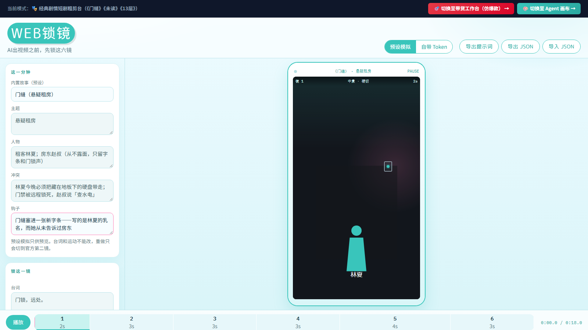

# 分册二 · 电商带货全链路（含短剧 legacy）

> 主手册：[HOW_TO_USE.md](./HOW_TO_USE.md) · 画布线分册：[HOW_TO_USE.canvas.md](./HOW_TO_USE.canvas.md)
> English: [HOW_TO_USE.commerce.en.md](./HOW_TO_USE.commerce.en.md)

---

## 目录

- [1. 六步爆款工作流](#1-六步爆款工作流)
- [2. 两个独立工作室](#2-两个独立工作室)
- [3. 视频供应商配置与 ComfyUI 私有算力](#3-视频供应商配置与-comfyui-私有算力)
- [4. 剪映 / CapCut 草稿导入与声画自动对齐](#4-剪映--capcut-草稿导入与声画自动对齐)
- [5. 数据反馈闭环：回流看板与胜率加权](#5-数据反馈闭环回流看板与胜率加权)
- [6. 剧情短剧粗剪台（legacy）](#6-剧情短剧粗剪台legacy)
- [7. 诚实边界](#7-诚实边界)

进入方式：顶栏「🎯 带货工作台」或深链 `?view=sell`。

---

## 1. 六步爆款工作流

点击顶部导航的「🛒 电商全链路工作流」，按工业化步骤执行。每个环节都有严格 Schema 约束。

### Step 0：商品信息多模态导入


- **链接导入**：输入电商主图链接，系统如实归档并引导填写核心差异化卖点；
- **图片导入**：支持上传高清商品白底图/透底图，内置 9 款 3C、美妆、服饰大厂级 Mock 预设图一键选用；
- **参考视频导入**：支持上传本地爆款对标视频片段，内置 Canvas 自动抽帧引擎。

### Step 1：5 大爆款结构与黄金 3 秒钩子选择


内置经百万播放验证的 5 套 6 镜带货套路：

1. **痛点开场型 (Pain-Solution)**：反常识开场 → 痛点共鸣放大 → 产品破局 → 核心功能微距 → 信任凭证背书 → 强引导限时下单；
2. **效果反差型 (Contrast-Shock)**：震撼对比 → 揭秘关键机理 → 深度实测 → 体验升级 → 资质打消顾虑 → 行动号召；
3. **沉浸开箱型 (Sensory-Unboxing)**：视听微距开箱 → 材质触感细节 → 交互仪式感 → 场景融入 → 性价比锚点 → 福利促单；
4. **短剧场景植入型 (Drama-Insert)**：人物生活矛盾冲突 → 戏剧化窘境 → 救场神器亮相 → 危机化解 → 情感共鸣 → 购买指引；
5. **价格锚点型 (Price-Anchor)**：大牌天价对比 → 打破暴利黑幕 → 极致做工对标 → 溯源源头成本 → 超值特惠释放 → 锁单催促。

### Step 2：双 Agent 剧本编导与对立面评审


- **编导智体 (ScriptWriter)**：结合商品卖点与所选套路，自动创作符合竖屏短视频传播节奏的 6 镜分镜台词与画面描述；
- **质检智体 (ScriptCritic)**：从「3 秒停留率、卖点可视化、完播节奏、合规风险」4 个维度严苛打分（0~100），
  并给出诊断雷达图与具体修改建议。

### Step 3：9:16 GSAP 动态分镜视觉预演


- 在向昂贵算力派发任务前，`sell-stage` 动态舞台基于 GSAP 进行 9:16 全真视觉模拟；
- 直观预览每个镜头的景别、推拉摇移运镜动势、卖点文字弹幕浮现节奏。

### Step 4：视觉提示词工程编译


- 自动将分镜剧本编译为高精度中英文双语视觉提示词（Positive / Negative Prompt）；
- 自动规范画幅（9:16）、镜头秒数（3~6 秒）、渲染参数（8K、光影质感、运镜轨迹与物理防畸变约束）。

### Step 5：串行任务队列与神经渲染调度


- 单机串行任务调度引擎自动调度各镜头任务；
- 支持可灵、即梦、**ComfyUI 私有集群**、Mock 本地录制、**Runway / Luma（海外 · 契约先行）**；
- 具备实时排队进度监控、单镜头独立失败重试与错误精准上报。

### Step 6：连续审片、TTS 口播与剪映草稿对齐导出


- 6 镜视频无缝连播审片播放器，支持全屏预览与单镜头逐一审阅；
- **智能 TTS 配音**：语速自适应算法，按镜头秒数缩放台词语速，确保台词在镜头结束前精准收尾；
- **剪映草稿工程直出**：一键导出对齐好的 `draft_content.json`，或下载含全部素材的完整 zip 包；
- 素材失效时（刷新导致本地缓存丢失）显示明确的失效占位提示，而非死链播放器。

---

## 2. 两个独立工作室

### 模式 A：单 Agent 极速直出模式


适合单镜头快速实验与图生视频：

- **精选灵感库**：3C 数码金属光泽、美妆水润精华露微距、潮流穿搭光影等高转化提示词预设；
- **AI 智能运镜润色**：输入简略构思（如「吹风机快速吹干水滴」），自动扩写为运镜、布光、景深齐全的电影级 Prompt；
- **多模态参考素材面板**：参考图片（拖拽上传 / 九宫格 Mock 载入 / 双击灯箱无损放大）、
  参考视频（提取动作参考 Motion Mimic）；
- **时长自由调节**：5s / 10s / 15s 预设，或微调框输入 1~60 秒。

### 模式 B：多 Agent 协同编导研讨室


- **两种推演模式（诚实标注）**：
  - **真实推演**：配置 LLM Key 后四智体由真实 LLM 结构化推演（编导 → 运镜 → 质检 → 调度），质检为真实差异化评分；
  - **演示动画模式**：未配置 Key 时时间线首条消息与徽章明确标注「🧪 演示动画模式 · 评分非真实」，**绝不伪造评分**；
- **轮询窗口可调**：顶部下拉 2/5/10/20 分钟，超时自动全额退款。

---

## 3. 视频供应商配置与 ComfyUI 私有算力


点击右上角「⚙️ API 设置」。引擎共 6 个选项：

| 引擎 | 凭据 | 计费 | 验证层级 |
|---|---|---|---|
| Mock 实验画布 | 无需 | 0 灵感币 | ✅ 本机验证 |
| 快手可灵 (Kling) | 裸 Key（Bearer）或 JSON `{"ak","sk"}`（官方 JWT 签名） | ~10 币/镜 | ✅ 契约验证 / ⏳ 待真实环境 |
| 字节即梦 (Jimeng) | 裸 Key 或 JSON `{"ak","sk"}`（火山 V4 HMAC-SHA256 签名） | ~8 币/镜 | ✅ 契约验证 / ⏳ 待真实环境 |
| 🔥 ComfyUI 私有算力 | Base URL（本地/局域网） | **0 接口费** | ✅ 本机验证 |
| **Runway (Gen-4)** | Bearer API Key | 按官方积分 | ✅ 契约验证 / ⏳ **待真实环境验证** |
| **Luma (Dream Machine)** | Bearer API Key | 按官方积分 | ✅ 契约验证 / ⏳ **待真实环境验证** |

> **海外引擎为「契约先行」**：请求体 / 端点 / 请求头 / 轮询状态映射 / 错误文案全部按官方文档实现，
> 并由 `test/fixtures/runway|luma/` + `src/media/__tests__/providerContract.test.ts` 锁定；
> **但尚未在真实账号下跑通出片**，UI 与文档均如实标注。未填 Key 时**不会发起任何请求**，
> 而是给出「未检测到 … API Key」的明确提示。如需自建网关，可设置 sessionStorage
> `weblockshot.runway_base` / `weblockshot.luma_base` 覆盖 Base URL。

### ComfyUI 私有算力（0 接口费）

1. **启动 ComfyUI**（必须带 `--listen`）：

   ```bash
   python main.py --listen 127.0.0.1 --port 8188
   ```

2. **推荐底模**：阿里 Wan 2.1（WanVideo I2V，14B / 1.3B）、智谱 CogVideoX-5B、Stability SVD-XT；
3. **绑定并探测**：设置面板 → 视频提供商选「ComfyUI 自建/私有算力」→ 填实例地址（本地默认
   `http://127.0.0.1:8188`）→ 点「🔍 测试连接 (Ping GPU)」→ 返回显卡型号与可用显存。

---

## 4. 剪映 / CapCut 草稿导入与声画自动对齐

在最后一步「✨ 审片交付」点击「📥 导出剪映电脑版草稿工程 (draft_content.json)」。

### 对齐原理

1. **三轨微秒对齐（1s = 1,000,000us）**：
   - `track_video`：6 镜视频无缝顺排；
   - `track_audio`：每镜配音与视频起止点微秒吻合；
   - `track_text`：带货花字，第 1 镜黄金钩子预设黄色高亮与更大字号；
2. **自适应防黑帧**：精确计算 `source_timerange` 与 `target_timerange`，杜绝黑帧与音频爆音重叠。

### 导入步骤（推荐 zip 包）


在「✨ 审片交付」页点击「📦 下载完整草稿 zip 包 (含素材)」，包内：

- `draft_content.json` / `draft_meta_info.json`：标准草稿工程（素材路径已改写为相对 `assets/...`）；
- `assets/`：已生成的分镜视频素材与可选旁白音频；
- `README-使用说明.txt`：本包素材清单（**缺失素材如实列出**）与导入步骤。

导入：

1. 解压 `<工程名>_剪映草稿.zip`；
2. 打开剪映电脑版新建空草稿后关闭；
3. 进入草稿目录（Windows 默认 `%LOCALAPPDATA%\JianyingPro\User Data\Projects\com.lveditor.draft\<草稿名>\`）；
4. 把 `draft_content.json`、`draft_meta_info.json` 与 `assets/` 复制进去（同名覆盖）；
5. 重新打开剪映即可看到三轨对齐的完整工程。

> 伴生服务在线时，页面会出现「📤 发送到伴生服务落盘」按钮，一键解压到本地草稿目录（见主手册伴生服务章节）。

---

## 5. 数据反馈闭环：回流看板与胜率加权


1. 点击顶部导航「📊 回流看板」；
2. 填写：视频标题、命中的结构模板与钩子、商品种类、平台的 **3 秒完播率 / 完播率 / 转化数**；
3. 点「📥 录入回流数据」，数据存入本地 IndexedDB；
4. 看板按**结构 / 钩子 / 品类**三维聚合胜率（纯 CSS 条形图，从高到低）；
5. 胜率采用 **Laplace 平滑**：`(胜出次数 + 1) / (样本数 + 2)`，其中 3 秒完播率 ≥ 30% 记为一次「胜出」；
6. 之后每次生成脚本，钩子采样按真实胜率加权——高胜率钩子优先被选中。

> 数据仅存本地浏览器 IndexedDB，不上传任何服务器。画布的记忆系统与这里**共用同一套聚合**。

---

## 6. 剧情短剧粗剪台（legacy）



- 进入方式：顶栏「🎭 剧情短剧」或深链 `?view=drama`；
- 内置《门缝》《未读》《13层》6 镜剧情预演与提示词包导出；
- **定位**：保留兼容与零回归（sell / drama 管线不在画布化改造范围内）；
  **新创作建议走 Agent 画布**（同样的分镜预演与出片能力，且支持自由拓扑与 Skill 复用）。

---

## 7. 诚实边界

- **可灵 / 即梦真实出片连通待真实环境**：签名与请求形状已契约验证，真实出片需你自备 Key 后
  `npm run verify:providers -- --kling-key=AK:SK --jimeng-key=AK:SK`；
- **Runway / Luma 待真实环境验证**（契约已实现并锁定，未跑通真实出片）；
- **Mock 引擎 0 灵感币**，其余引擎按各自定价走虚拟钱包两阶段事务；
- 未配置 Key 时相关引擎**如实禁用并提示**，不会假装可用；
- **运行历史的入口在画布侧**（画布工具条「🕘 运行历史」，用法见分册一 §5）：带货工作台的逐镜出片走的是
  **同一个执行器**，因此同样会写入运行历史（含费用与是否退款），但当前**未在带货工作台内提供独立入口**；
- **窄屏（<768px）**：顶栏模式切换不再竖排、画布侧节点面板改为底部横滚、小地图与快捷键提示隐藏
  （详见主手册「（六）手机端使用」）。
