# WebLockShot — Complete Guide & Industrial Playbook

> English edition. The Chinese [`HOW_TO_USE.md`](./HOW_TO_USE.md) is canonical and may carry extra detail.
> This guide helps e-commerce sellers, live-commerce hosts, creative directors and AI-video engineers get
> productive with WebLockShot's core pipeline, its two studios, private ComfyUI compute, and automated
> CapCut/Jianying draft alignment.

---

## Contents

- [(0) Introduction and positioning](#0-introduction-and-positioning)
- [(1) Quick start: online vs private deployment](#1-quick-start-online-vs-private-deployment)
- [(2) The six-step commerce workflow](#2-the-six-step-commerce-workflow)
- [(3) The two standalone studios](#3-the-two-standalone-studios)
- [(4) Video providers and private ComfyUI compute](#4-video-providers-and-private-comfyui-compute)
- [(5) CapCut / Jianying draft import and automatic alignment](#5-capcut--jianying-draft-import-and-automatic-alignment)
- [(6) Feedback loop: dashboard and win-rate weighting](#6-feedback-loop-dashboard-and-win-rate-weighting)
- [(7) Companion server and one-click draft unpacking](#7-companion-server-and-one-click-draft-unpacking)
- [(8) Industrial reliability](#8-industrial-reliability)
- [(9) FAQ and pitfalls](#9-faq-and-pitfalls)
- [(10) Mobile: installing the PWA](#10-mobile-installing-the-pwa)
- [(11) Docker production deployment](#11-docker-production-deployment)
- [(12) Mini program light client](#12-mini-program-light-client)

---

## (0) Introduction and positioning

**WebLockShot** is a **multi-Agent, closed-loop short-video production platform** for commerce video and
e-commerce visual creators.

Producing a commerce short video that the platform's recommendation system actually likes used to mean:

1. **Expensive ideation** — manual scriptwriting with no grasp of the first-3-second retention playbook;
2. **Fragmented tooling** — sourcing product images, tuning Midjourney/Sora prompts, rendering on a vendor site,
   downloading, then dragging everything into an editor by hand;
3. **Costly, unprotected APIs** — cloud video APIs charge per call, and retries or double clicks cause double billing;
4. **Audio/video mismatch** — generated clips have fixed lengths that do not match narration or subtitle timing.

WebLockShot closes the loop: **from selling-point input, structure templates, dual-Agent script deliberation,
9:16 dynamic preview and self-hosted ComfyUI / commercial API rendering, all the way to a CapCut draft project
with microsecond-level audio/video/subtitle alignment — entirely in the browser.**

### Traditional workflow vs WebLockShot

| Stage | Manual production | Typical AI wrapper | WebLockShot |
| :--- | :--- | :--- | :--- |
| **Viral know-how** | Improvised by the creator | Rough single-pass text expansion | **5 proven structure templates + a golden-3-second hook library** (strict Zod contracts) |
| **Script quality** | Written blind, no review | One long blob of text | **ScriptWriter + ScriptCritic dual-Agent deliberation with strict scoring** |
| **Pre-render preview** | Mental imagery or a black screen | No preview, blind render | **9:16 GSAP storyboard stage** simulating camera moves and transitions in milliseconds |
| **Render compute** | Manual clicks on one vendor page | One closed cloud API | **Four engines**: Kling, Jimeng, **private ComfyUI GPU (Wan 2.1)**, mock lab canvas |
| **Cost** | Expensive API fees | Token markups | **Zero API fees**: talk straight to a local RTX 4090 / A100 ComfyUI |
| **Deduplication & money safety** | Double charges, no refunds | Failed charges not returned | **Industrial two-phase wallet** (freeze → settle / rollback) + SHA-256 idempotency |
| **Editing delivery** | Manual track dragging and slicing | Standalone MP4 only | **CapCut / Jianying draft export**: video + narration + styled-subtitle tracks aligned automatically |

---

## (1) Quick start: online vs private deployment

### 1. Zero-config, no-install experience

- Online: <https://qwqcool.github.io/WebLockShot/>
- **No server dependency, no sign-up**: every key stays in the browser's `sessionStorage` and is never uploaded
- **Works without keys**: a mock live-canvas recording engine and a 0-key rule-based template engine let you
  walk the entire pipeline for free

### 2. Local development

For teams with a local GPU (RTX 3090/4090/A100) or an intranet deployment:

```bash
# clone
git clone https://github.com/QWQcool/WebLockShot.git
cd WebLockShot

# install dependencies
npm install

# start the dev server (ComfyUI reverse proxy enabled automatically)
npm run dev
```

Then open `http://localhost:5173`.

---

## (2) The six-step commerce workflow

Click **“🛒 commerce workflow”** in the top navigation and follow the industrial steps. Every stage is backed by
schema-validated data assets and validated against real distribution data.

### Step 0: multimodal product import

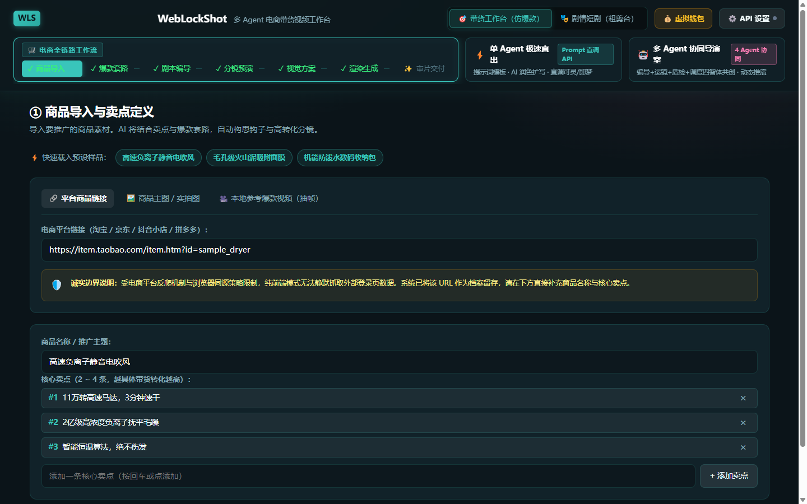

- **Link import**: paste a product image URL; the system archives it honestly and guides you to write the core
  differentiating selling points
- **Image import**: upload a white-background or transparent product shot, or pick one of the nine built-in
  3C / beauty / apparel mock presets
- **Reference video import**: upload a local reference clip; a Canvas-based frame-extraction engine samples it

### Step 1: choose a structure and a golden-3-second hook

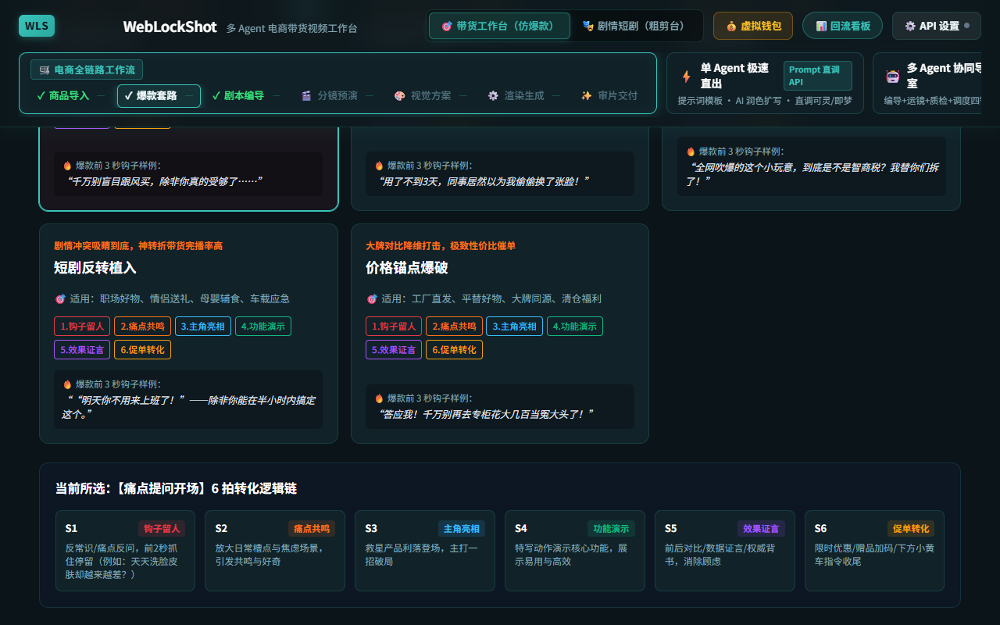

Five six-shot structures validated by real distribution data:

1. **Pain-Solution**: counter-intuitive opening → amplify the pain → the product breaks through → macro of the
   core feature → trust evidence → urgent call to action
2. **Contrast-Shock**: shocking comparison → reveal the mechanism → deep hands-on test → upgraded experience →
   credentials remove doubt → call to action
3. **Sensory-Unboxing**: audio-visual macro unboxing → material and texture details → ritual of interaction →
   scene integration → value anchor → offer to close
4. **Drama-Insert**: everyday conflict → dramatic predicament → the fix arrives → crisis resolved → emotional
   resonance → purchase guidance
5. **Price-Anchor**: premium price comparison → expose the markup → benchmark craftsmanship → trace the source
   cost → release the deal → lock the order

### Step 2: dual-Agent scripting and adversarial review

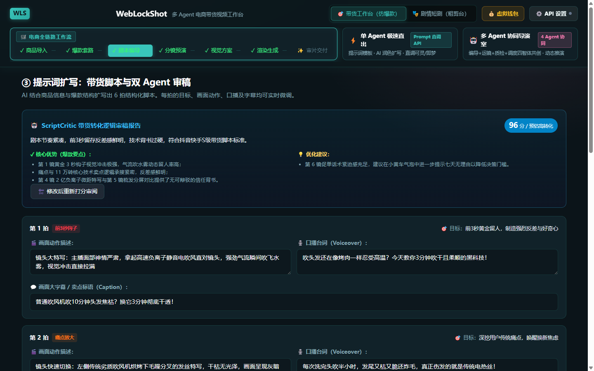

- **ScriptWriter**: combines the selling points with the chosen structure to write six shots of vertical-video
  dialogue and visuals
- **ScriptCritic**: acts as a demanding platform reviewer, scoring 0–100 across four axes (3-second hold,
  selling-point visualisation, completion pacing, compliance) and returning a radar chart plus concrete fixes

### Step 3: 9:16 GSAP storyboard preview

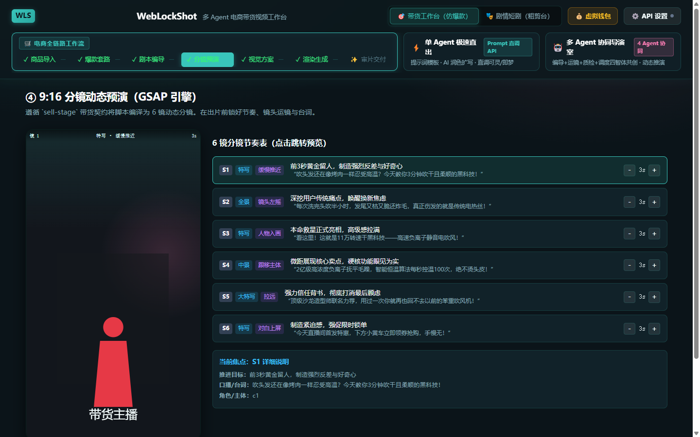

- Before dispatching anything to expensive compute, the `sell-stage` GSAP stage renders a full 9:16 simulation
- Preview each shot's framing (close-up, medium, wide), push/pull/pan/tilt motion, and the beat of on-screen
  selling-point captions

### Step 4: visual prompt compilation

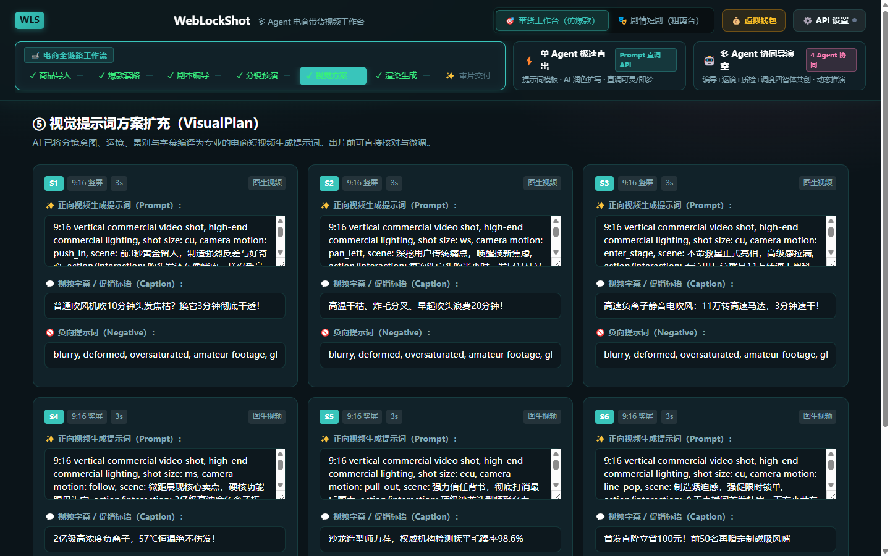

- Storyboards are compiled into precise bilingual positive/negative prompts
- Aspect ratio (9:16), shot duration (3–6 s) and render parameters (8K, lighting, camera path, anti-distortion
  constraints) are normalised automatically

### Step 5: serial task queue and rendering

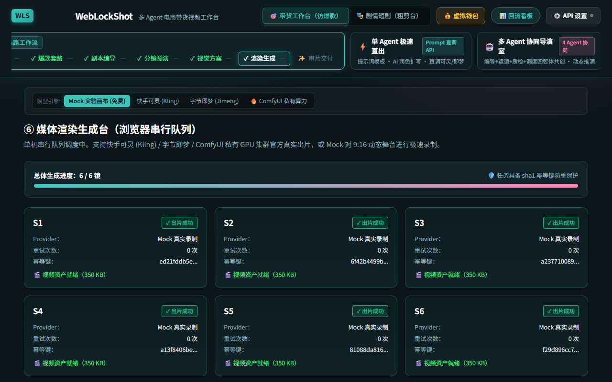

- A single-machine serial scheduler dispatches each shot
- Backed by Kling, Jimeng, **private ComfyUI** or the mock local recorder
- Live queue progress, per-shot retry, and precise error reporting

### Step 6: review, TTS narration and draft export

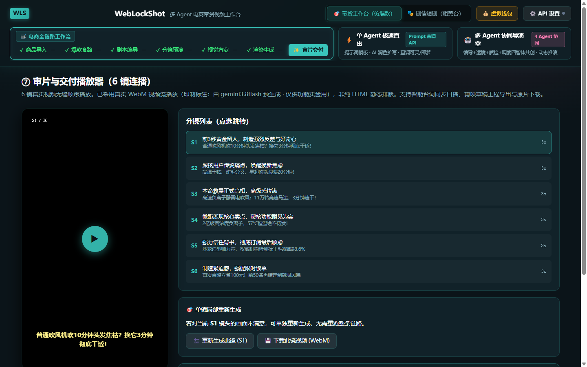

- A six-shot seamless review player with full-screen preview and per-shot inspection
- **Adaptive TTS**: speaking rate scales to each shot's duration so the line finishes exactly on time
- **Draft export**: one click produces the aligned `draft_content.json`, or download the full zip including all
  assets (see [(5)](#5-capcut--jianying-draft-import-and-automatic-alignment))
- When an asset is gone (local cache lost after a refresh) the UI shows an explicit “expired” placeholder
  instead of a dead player

---

## (3) The two standalone studios

Beyond the six-step flow, the top bar offers two studios for fast single-shot work and complex direction.

### Mode A: single-Agent fast path


For single-shot experiments and image-to-video:

- **Curated inspiration library**: high-conversion presets such as 3C metallic sheen, beauty serum macro and
  streetwear lighting
- **AI camera-movement polishing**: type a rough idea (“a hair dryer quickly drying water droplets”) and the AI
  expands it into a cinematic prompt with camera, lighting and depth of field
- **Multimodal reference panel**: reference images (drag and drop, nine-grid mock loading, double-click
  lightbox) and reference videos (motion mimic)
- **Flexible duration**: 5 s / 10 s / 15 s presets or a custom 1–60 s value

### Mode B: multi-Agent director room

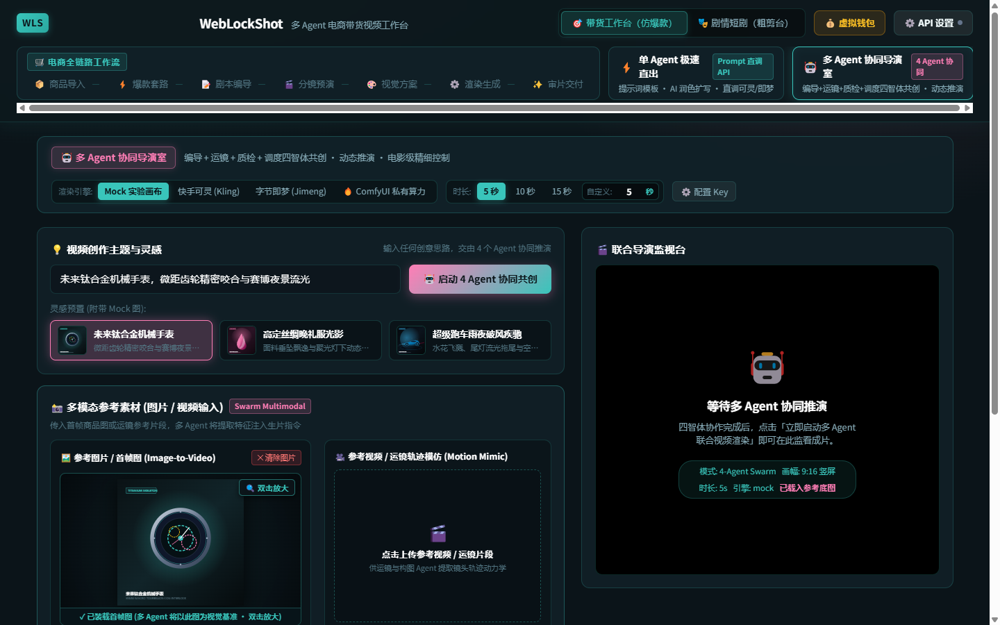

For bespoke shorts and complex multi-shot work:

- **Two honest modes**:
  - **Real deliberation**: with an LLM key configured in “⚙️ API settings”, four agents deliberate through a real
    LLM — director → cinematographer → critic → dispatcher — and the QA score is a genuine differentiated score
  - **Demo animation mode**: without a key, the first timeline message and the project badge explicitly say
    “🧪 demo animation mode · scores are not real”; the content is pre-authored and no score is fabricated
- **Agent roles**: 🎬 Director (visual tone, narrative arc), 🎥 Cinematographer (blocking, focal length,
  lighting), ⚖️ Critic (risk review with itemised deductions), ⚡ Dispatcher (combines everything into the final
  prompt and dispatches it)
- **Configurable polling window**: 2/5/10/20 minutes from the top bar; timeouts always refund in full

---

## (4) Video providers and private ComfyUI compute

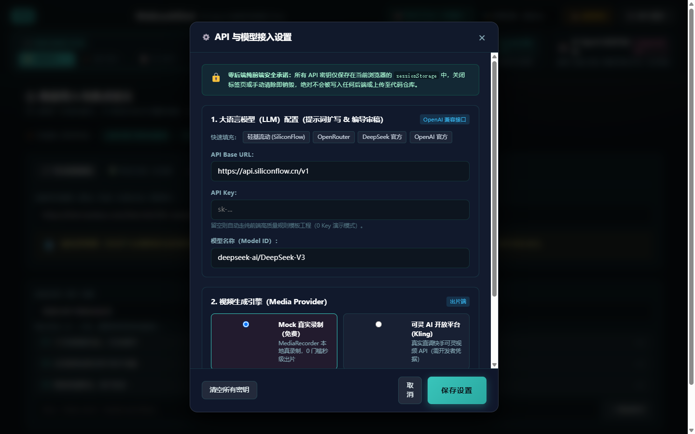

Open **“⚙️ API settings”** in the top-right corner.

### 1. Kling direct API

- Apply for an Access Key ID and Secret Key on Kuaishou's developer platform
- **Two auth shapes** (M2 contract upgrade):
  - a bare key string → Bearer pass-through (historical behaviour)
  - JSON `{"ak":"...","sk":"..."}` → the client signs a JWT per the official docs (HS512, `iss/exp/nbf`
    payload, sent directly as the token header without a Bearer prefix); the implementation is locked by
    contract tests against official vectors
- Billing: roughly 10 credits per shot in the virtual wallet

### 2. Jimeng direct API

- Enter the Jimeng open-platform API key and endpoint
- **Two auth shapes**:
  - a bare key string → Bearer pass-through
  - JSON `{"ak":"...","sk":"..."}` → per-request HMAC-SHA256 signing following the Volcengine V4 spec
    (`X-Date` / `X-Content-Sha256` / `Authorization`), locked by contract tests against official vectors
- Billing: roughly 8 credits per shot

### 3. Private ComfyUI GPU cluster (Wan 2.1 / CogVideoX)

This is WebLockShot's strongest industrial feature — **connect your own GPU and produce unlimited short videos
with zero API fees.**

#### Step 1: start ComfyUI locally

Make sure ComfyUI accepts external/LAN connections — `--listen` is required:

```bash
python main.py --listen 127.0.0.1 --port 8188
```

*(On a LAN GPU server use `--listen 0.0.0.0`.)*

#### Step 2: recommended models

- **Alibaba Wan 2.1 (WanVideo I2V)** — outstanding open-source image-to-video, 14B / 1.3B variants
- **Zhipu CogVideoX-5B** — strong large-motion dynamics and cinematic lighting
- **Stability SVD-XT** — lightweight macro product showcases

#### Step 3: bind it in WebLockShot and probe

1. Open **“⚙️ API settings”**
2. Choose **“ComfyUI self-hosted / private compute (0 API fees)”** as the video provider
3. Enter the instance URL (the default `http://127.0.0.1:8188` is usually fine; Vite proxies `/api/comfyui` to
   avoid CORS)
4. Click **“🔍 test connection (ping GPU)”**
5. The system calls `/system_stats` and immediately returns the GPU model (e.g. `NVIDIA GeForce RTX 4090`) and
   free VRAM

---

## (5) CapCut / Jianying draft import and automatic alignment

In the final **“✨ review & deliver”** step, click **“📥 export CapCut draft (draft_content.json)”**.

### How the alignment works

The exported `draft_content.json` is a standard CapCut/Jianying project:

1. **Three tracks aligned to the microsecond (1 s = 1,000,000 µs)**:
   - `track_video`: the six shots in seamless order
   - `track_audio`: narration start/end points match the video exactly
   - `track_text`: viral styled captions; shot 1's golden hook is pre-set to yellow highlight and a larger size
2. **No black frames**: `source_timerange` and `target_timerange` are computed precisely so there are no black
   frames or overlapping audio peaks

### Importing into CapCut desktop

1. Open CapCut/JianyingPro desktop and create a blank draft (e.g. `hair-dryer-commerce`)
2. Locate the draft folder:
   - **Windows**: `C:\Users\<you>\AppData\Local\JianyingPro\User Data\Projects\com.lveditor.draft\`
   - **macOS**: `~/Movies/JianyingPro/User Data/Projects/com.lveditor.draft/`
3. Open the folder named after your draft and replace `draft_content.json` with the downloaded one
4. Reopen the project — every shot, narration line and caption is already aligned

### Recommended: the draft zip

> Prefer the zip: you get the project file, every rendered asset and instructions in one download.

On the **“✨ review & deliver”** page click **“📦 download full draft zip (with assets)”**.

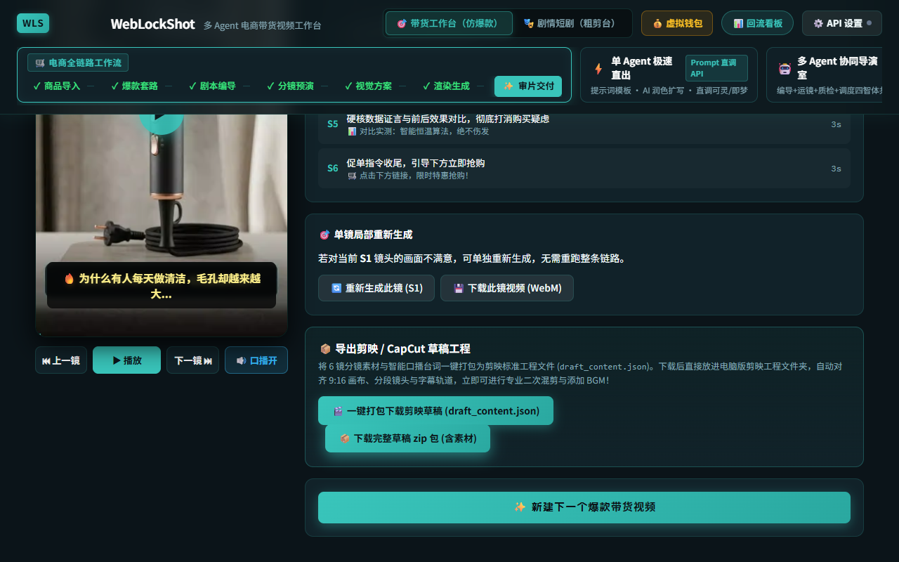

Contents:

- `draft_content.json` / `draft_meta_info.json`: the standard draft project (asset paths rewritten to relative
  `assets/...` paths)
- `assets/`: rendered shot videos (`Shot_N_<n>.mp4/webm`) and optional narration (`voice_<n>.mp3`)
- `README-使用说明.txt`: the asset manifest for this package (missing assets are listed honestly) and import steps

Steps:

1. Unzip `<project>_剪映草稿.zip`
2. Open CapCut desktop, create an empty draft, then close it
3. Enter the draft folder (Windows default
   `%LOCALAPPDATA%\JianyingPro\User Data\Projects\com.lveditor.draft\<draft>\`)
4. Copy `draft_content.json`, `draft_meta_info.json` and `assets/` into it (overwrite)
5. Reopen CapCut — the fully aligned project is ready

> Note: browser Web Speech TTS cannot export audio. If `assets/voice_*.mp3` is missing, record a file with the
> same name into `assets/`, or delete the empty audio segment in the editor.

---

## (6) Feedback loop: dashboard and win-rate weighting

WebLockShot implements “publish → feedback → weight → regenerate”, moving hook selection from intuition to data.

### Hook library and metadata routing

The five structures (pain question / contrast / unboxing / drama twist / price anchor) and the hook phrase
library live as **JSON data assets** (`src/assets/hooks/structures.data.json`), each carrying three kinds of
metadata:

- **categories**: e.g. beauty & skincare / tech & gadgets / affordable alternatives — ScriptWriter routes to the
  best-matching structure automatically
- **emotionArc**: the emotional anchor of each of the six beats (anxiety → resonance → surprise → focus → trust → urgency)
- **baselineWinRate / hookWinRates**: prior weights that real feedback can override at runtime

### Using the dashboard

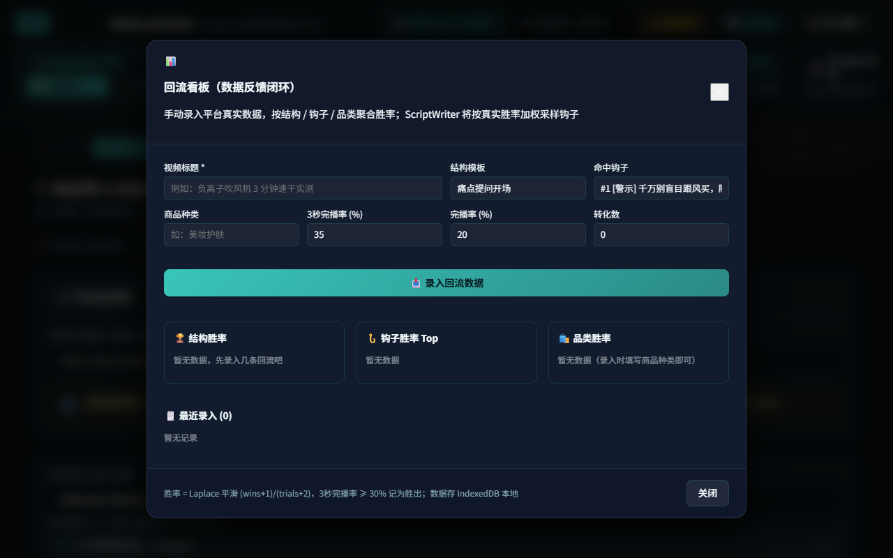

1. Click **“📊 feedback dashboard”** in the top navigation
2. Fill in the form: video title, matched structure template and hook, product category, and the platform's
   **3-second view-through / completion rate / conversions**
3. Click **“📥 record feedback”** — the record is stored in local IndexedDB
4. The dashboard below aggregates win rates across **structure / hook / category** (pure CSS bars, sorted high to low)
5. Win rates use **Laplace smoothing**: `(wins + 1) / (trials + 2)`, where a 3-second view-through rate ≥ 30%
   counts as a win — this avoids overfitting small samples
6. Every subsequent script generation weights hook sampling by real win rates, so high-performing hooks are
   picked more often

> Data lives only in your browser's IndexedDB and is never uploaded.

---

## (7) Companion server and one-click draft unpacking

The pure front-end build on GitHub Pages cannot talk to ComfyUI or video APIs directly (CORS) and cannot write
drafts to your disk. The **companion server** (pure Node, only `pino` at runtime) solves both, plus a set of
reserved switches (setting no `WLS_*` variable = the local default, identical to the pure front end).


### One command

```bash
npm run build && npm run start:server    # default http://localhost:5174
# equivalent npx form: npx weblockshot
# custom: node server/weblockshot-server.mjs --port 8080 --dist ./dist --draft-dir ./jianying-drafts
```

Windows users can double-click **`start-weblockshot.bat`** (installs → builds → starts).

### Capabilities

| Capability | Description |
| :--- | :--- |
| Static hosting | Serves the production `dist/` build at `http://localhost:5174` |
| API proxy | `/api/kling`, `/api/jimeng`, `/api/comfyui` reverse proxies so production can reach ComfyUI and vendor APIs |
| Draft unpacking | `POST /api/jianying/draft-zip` (zip body) unpacks into `--draft-dir`, no manual unzipping |
| Narration | `POST /api/tts` (Edge-TTS mp3; on by default, `WLS_TTS=off` disables), read back via `GET /files/tts/<file>.mp3` |
| Composition | `POST /api/render` (ffmpeg merges video + audio + subtitles; `auto` by default, `WLS_FFMPEG=off` disables), read back via `GET /files/render/<file>.mp4` |
| Health check (reserved) | `GET /healthz` returns version / storage mode / uptime / key mode / capability flags (tts, ffmpeg, memory, connectors, mcp) |
| Session API (reserved) | `PUT/GET/DELETE /api/sessions/:id` for the front end's `VITE_BACKEND_URL` server mode; persisted when `WLS_STORAGE=sqlite` |
| LLM proxy (reserved) | With `WLS_LLM_TARGET` set, `/api/llm` proxies to it; otherwise 501 |
| Key injection (reserved) | With `WLS_KEYS` (JSON) set, the proxy injects real key headers so keyless clients (like the mini program) can render |
| Structured logs | pino JSON lines, level controlled by `WLS_LOG_LEVEL` |

> The full environment-variable table is in the main README under “Production deployment”; one-command Docker
> deployment is in [(11)](#11-docker-production-deployment).

### One-click draft unpacking

**Option A: in-app (recommended)**

1. Start the companion server as above
2. Open the workbench's “delivery player” page — the front end probes `/healthz`; when the server is online the
   export card shows **📤 send to companion server**
3. Click it: the full draft zip (with assets) is POSTed to `/api/jianying/draft-zip` and unpacked server-side;
   the unpacked path (`savedPath`) is displayed. Point `--draft-dir` at your CapCut draft folder to open it directly
4. If the probe fails (pure front-end mode) the button is hidden and nothing changes — use option B

**Option B: manual with curl**

1. Start the companion server (note the draft folder in the startup log)
2. POST the downloaded zip to `http://localhost:5174/api/jianying/draft-zip`
3. The response is `{ ok: true, savedPath: "...", files: [...] }`; move the contents into your draft folder

### Narration workflow (TTS → CapCut audio track)

1. Confirm the server is up and `WLS_TTS` is not `off` (`curl http://localhost:5174/healthz` shows `"tts":"on"`)
2. Synthesize:

   ```bash
   curl -X POST http://localhost:5174/api/tts \
     -H "Content-Type: application/json" \
     -d '{"text":"your narration line","voice":"zh-CN-XiaoxiaoNeural","rate":"+10%"}'
   ```

3. The returned `url` (e.g. `/files/tts/xxx.mp3`) can be opened in the browser; the file lands in `data/tts/`
4. In CapCut: drag the mp3 onto an audio track, or rename it to `voice_<n>.mp3` and place it in the draft's
   `assets/` folder to fill a missing narration asset
5. Advanced: pass the mp3 URL as `audioUrl` to `POST /api/render` to compose the final video with narration

### Server-side composition with ffmpeg

1. Install ffmpeg (`winget install ffmpeg` on Windows, `brew install ffmpeg` on macOS; the Docker image ships
   it) and confirm `/healthz` shows `"ffmpeg":"on"`
2. Compose (`videoUrl` accepts same-site `/files/...` paths or public http(s) URLs):

   ```bash
   curl -X POST http://localhost:5174/api/render \
     -H "Content-Type: application/json" \
     -d '{"videoUrl":"/files/tts/video.mp4","audioUrl":"/files/tts/xxx.mp3","title":"my-render"}'
   ```

3. The response is `{ url: "/files/render/render_xxx.mp4", bytes }`; open it to download or preview
4. Optionally pass `subtitleSrt` (SRT text) to soft-mux subtitles; only one render runs at a time (429 when
   busy) with a 10-minute default timeout (`WLS_RENDER_TIMEOUT_SEC`)
5. Safety: `file://` and private network addresses are rejected (SSRF protection); remote downloads are capped
   at 500 MB

---

## (8) Industrial reliability

### 1. Idempotency and double-click locks

- **Structured intent signature**: a unique idempotency fingerprint from canonicalised
  `(intent, shotId, provider, prompt, duration, ratio)`
- **In-flight mutex**: duplicate clicks are blocked while a task is running, preventing concurrency storms

### 2. FSM and circuit breaker

- **ShotJob state machine**: `queued → running → succeeded/failed` (retry via `failed → queued`) guarded by the
  `JOB_STATUS_TRANSITIONS` table; illegal transitions throw immediately
- **Circuit breaker**: 3 consecutive failures on a cloud API trip the breaker and block that channel; it
  half-opens after 30 s. The studio badge shows normal / protected / probing live (mock and self-hosted ComfyUI
  are exempt)

### 3. Two-phase commit virtual wallet


- **“💰 virtual wallet”** lives in the top navigation and uses a **per-refId freeze ledger** (amount / provider /
  timestamp per freeze)
- **Phase 1 — freeze**: on render, the estimated cost moves into “frozen” so funds cannot be overspent
- **Phase 2A — settle**: on success the frozen amount is deducted
- **Phase 2B — refund**: on network failure, timeout or error the frozen amount is returned in full
- **Receipt safety**: settle/refund without a freeze receipt is rejected; repeated settlement for the same task
  is idempotent; a settled task cannot be refunded
- **Orphan reclamation**: unclaimed freezes are refunded after 30 minutes
- **Cross-tab sync**: balances and statements stay consistent across tabs
- Full audit trail plus simulated top-up and reset

---

## (9) FAQ and pitfalls

#### Q1: network errors or timeouts when calling local ComfyUI?

- **A**: check that ComfyUI was started with `--listen` (`python main.py --listen 127.0.0.1 --port 8188`)
- **B**: in development WebLockShot proxies `/api/comfyui` through Vite — make sure you opened
  `http://localhost:5173`, not a local HTML file

#### Q2: why does rendering say “insufficient wallet balance”?

- WebLockShot has industrial overdraft protection. Open **“💰 virtual wallet”** and click **“+1,000 credits”**
  or **“reset 2,000 trial credits”**. ComfyUI and mock modes cost 0 and never charge.

#### Q3: what if I dislike one shot?

- In step 6 you do not need to re-run everything: click **“🔄 regenerate this shot”** next to the offending shot
  and only that shot is re-dispatched.

#### Q4: the exported draft shows assets as offline?

- The draft records local paths or URLs. If the source was a locally recorded blob URL, place the downloaded
  asset files next to the draft and the editor will relink automatically.

---

## (10) Mobile: installing the PWA

WebLockShot is a PWA, so a mobile browser can install it as a near-native app.

### Add to home screen

1. Open your deployment URL in a mobile browser (iOS Safari / Android Chrome)
2. **iOS Safari**: share button → “Add to Home Screen” → confirm
3. **Android Chrome**: “⋮” menu → “Add to Home screen / Install app” → confirm
4. Launching from the icon runs a **standalone full-screen window** (no address bar) with the WebLockShot cyan
   theme colour (#22d3ee)

### Notes

- **Self-update**: a “🚀 new version available” bar appears after a release; tapping refresh updates in place
  (prompt mode never interrupts an in-flight render)
- **Keys and data**: identical to desktop — API keys live in `sessionStorage`, sessions in IndexedDB, nothing is
  uploaded
- **Responsive**: below 768 px the layout stacks into one column (the six-step bar becomes a compact indicator,
  engine bars collapse, tables scroll horizontally); at 768 px and above it matches desktop
- **Touch**: every tappable area is ≥44 px, and the product page opens the rear camera directly
  (`capture="environment"`, touch devices only)
- **Background correctness**: returning to the foreground refreshes polling immediately

---

## (11) Docker production deployment

For servers, intranet sharing or private delivery.

### One command

```bash
git clone https://github.com/QWQcool/WebLockShot.git
cd WebLockShot
docker compose up --build      # first build takes about 2–4 minutes
```

After startup:

- App: `http://localhost:8080` (change ports in `docker-compose.yml`)
- Health: `http://localhost:8080/healthz` returns version / storage mode / uptime
- The compose file includes a healthcheck (probes `/healthz` every 30 s) and restarts on failure

### Reserved switches (compose environment)

Every `WLS_*` variable follows the “interface ready, unused by default” principle — **setting nothing means the
local default, identical to the pure front end**. Common configuration:

```yaml
environment:
  - PORT=5174
  # session persistence (reserved): sqlite persisted to the /app/data volume
  - WLS_STORAGE=sqlite
  # narration (on by default): /api/tts writes mp3 to the /app/data/tts volume
  # - WLS_TTS=off
  # composition (auto by default): the image ships ffmpeg, /api/render writes mp4 to /app/data/render
  # - WLS_FFMPEG=auto
  # - WLS_RENDER_TIMEOUT_SEC=600
  # LLM proxy (reserved): enables /api/llm
  - WLS_LLM_TARGET=https://api.openai.com
  # key injection (reserved): the server holds the real keys, clients need none
  - WLS_KEYS={"kling":"Bearer ak-xxx","llm":"Bearer sk-xxx"}
```

### HTTPS

The compose file includes a commented Caddy template: uncomment it and write a `Caddyfile`
(`your-domain.com { reverse_proxy weblockshot:5174 }`); Caddy issues and renews Let's Encrypt certificates
automatically. nginx + certbot works the same way.

### Image structure

Multi-stage build: stage 1 (`node:22-slim`) runs `npm ci` + `tsc -b && vite build`; stage 2 (runtime,
`node:22-alpine`, **ffmpeg included** for `/api/render`) contains only `dist/`, `server/` and production
dependencies (no devDependencies). `./data` (TTS audio / renders / sqlite session DB) and `./jianying-drafts`
are mounted as persistent volumes. CI runs a build-only image verification job on every push.

---

## (12) Mini program light client

`miniapp/` contains a WeChat mini program (weapp) light client (Taro 4 + React 18, in the main branch) covering
“enter product → task progress → watch & deliver”.

### Honest boundaries

The mini program does **not** export CapCut drafts (needs a desktop filesystem) and does **not** include the mock
engine or GSAP animation system. After watching, copy the video link and finish the CapCut delivery on the
desktop workbench. See [miniapp/README.md](../miniapp/README.md).

### Reuse with the desktop app

- It reuses zero-dependency domain modules from the main repo via the `@domain` alias (e.g. `pollingConfig`),
  with **zero changes to the main `src/`**
- Dependencies are fully independent (own `package.json`, React pinned to 18.3.1 for Taro compatibility)

### Backend and key safety

- All task requests go through the `/api` proxy of the backend pointed to by `TARO_APP_API_BASE` (companion
  server or a cloud gateway)
- **The mini program holds no API key** — keys are injected server-side via `WLS_KEYS`; without it the remote
  explicitly returns 401

### Build and deployment

```bash
cd miniapp
npm install
npm run build:weapp    # compiles without WeChat DevTools; output in miniapp/dist/
```

- **Request domains**: add your backend domain to the mini program's legal request domain list (requires
  **HTTPS + an ICP-filed domain**)
- **Account type**: `touristappid` is preview-only in the local DevTools; `web-view` and some advanced APIs need
  a **corporate account**
- Output structure: `dist/app.json` registers three pages, each with its js/json/wxml/wxss quartet
