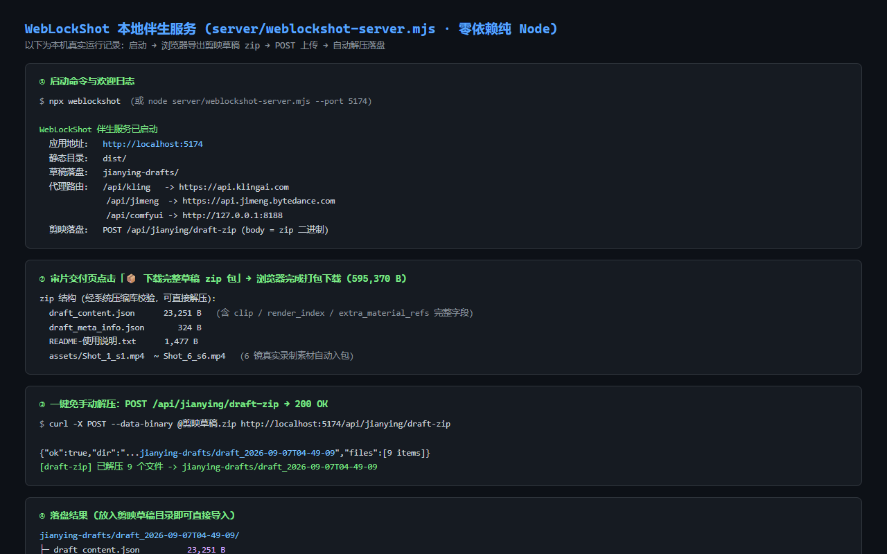
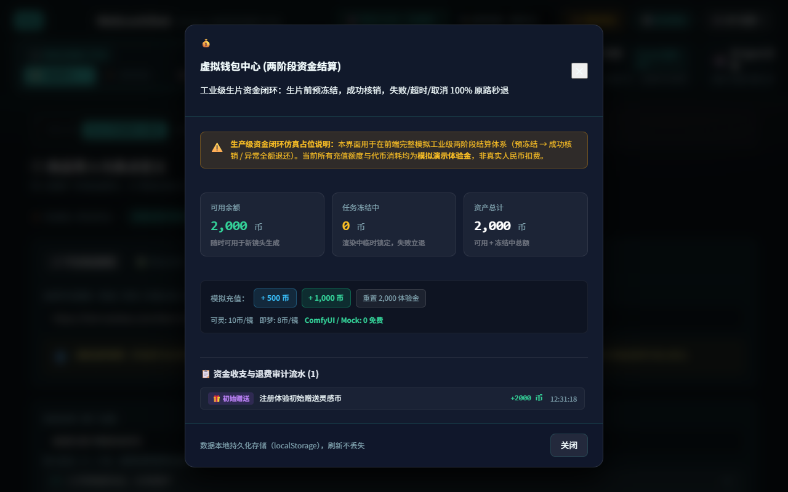

# WebLockShot 完整使用指南与工业化实战手册（主手册）

> 🌐 **English edition**: [HOW_TO_USE.en.md](./HOW_TO_USE.en.md)
>
> 本手册采用**一主两分**结构：
> - **主手册（本文）**：定位、快速上手、三线导航、通用能力（伴生服务 / Docker / PWA / 小程序 / 可靠性 / FAQ）
> - **分册一**：[Agent 创意画布（主线）](./HOW_TO_USE.canvas.md) —— 画布全部能力与操作
> - **分册二**：[电商带货全链路（含短剧 legacy）](./HOW_TO_USE.commerce.md) —— 六步工作流、双工作室、引擎配置、剪映交付、回流看板

---

## 目录

- [（序）介绍与定位](#序介绍与定位)
- [（一）快速上手：免安装在线版 vs 团队私有部署](#一快速上手免安装在线版-vs-团队私有部署)
- [（二）三条产品线导航](#二三条产品线导航)
- [（三）本地伴生服务部署与剪映草稿一键落盘](#三本地伴生服务部署与剪映草稿一键落盘)
- [（四）工业级可靠性体系：幂等防抖、状态机与两阶段钱包闭环](#四工业级可靠性体系幂等防抖状态机与两阶段钱包闭环)
- [（五）常见问题与避坑指南（FAQ）](#五常见问题与避坑指南faq)
- [（六）手机端使用：PWA 添加到主屏幕](#六手机端使用pwa-添加到主屏幕)
- [（七）Docker 生产部署](#七docker-生产部署)
- [（八）小程序版轻端](#八小程序版轻端)
- [（九）质量验证与测试工程化](#九质量验证与测试工程化)

---

## （序）介绍与定位

**WebLockShot** 是一款面向竖屏短视频与电商视觉创作者的 **多 Agent 闭环短视频生成平台**，
v2.4 起以 **Agent 创意画布**为主线（自由创作空间），同时保留成熟的**电商带货全链路**与 legacy 的
**剧情短剧粗剪台**。

过去创作一条符合平台推流机制的电商爆款短视频，通常面临如下痛点：

1. **创意开销大**：依赖人工编写脚本，不懂前 3 秒黄金完播率套路；
2. **多工具断层**：找商品图、打磨 Midjourney/Sora 提示词、可灵网页生片、下载再拖入剪映手动拼接剪辑，全流程分散低效；
3. **接口资费昂贵且无防重保障**：云端视频 API 动辄几毛到几块钱一次，网络重试或连击经常造成重复扣费；
4. **声画割裂**：生成的视频片段长度固定，与配音解说字幕时长不匹配，人工拉伸音频费时费力。

WebLockShot 实现了全链路整合突破：**从商品卖点输入、爆款结构套用、双 Agent 剧本研讨、9:16 动态预演、
自建 ComfyUI / 商业 API 渲染生成，到剪映草稿工程声画字三轨微秒自动对齐，全流程浏览器内闭环！**
画布模式进一步把这条链路拆成**可自由摆放、可沉淀复用、可被本地 Agent 驱动**的节点拓扑。

### 传统工作流 vs WebLockShot 核心特性对比

| 环节 / 能力 | 传统人工制作模式 | 一般套壳 AI 工具 | WebLockShot 工作台 |
| :--- | :--- | :--- | :--- |
| **爆款规律把控** | 编导凭个人感觉拼凑 | 单一文本粗糙扩写 | **内置 5 大爆款结构套路库 + 黄金 3 秒强对抗钩子库**（Zod 强约束） |
| **脚本编导质量** | 单人盲写，缺乏审校 | 直接输出一段长文本 | **ScriptWriter + ScriptCritic 双智体剧本推演与严苛批判打分** |
| **生片前可控预演** | 脑内想象或黑屏等待 | 无法预演，直接开盲盒 | **9:16 GSAP 动态分镜舞台**，毫秒级模拟镜头运镜与转场节奏 |
| **渲染算力支持** | 仅能在特定官方网页手动点 | 仅对接 1 家闭源云端 API | **六擎可选**：Mock、可灵、即梦、**ComfyUI 私有显卡 (Wan 2.1)**、Runway、Luma |
| **出片成本** | 商业 API 接口费昂贵 | 充值代币高溢价抽成 | **0 接口费自由**：直连本地 RTX 4090 / A100 ComfyUI，边际成本趋向于 0 |
| **防重与资金安全** | 连击重复扣费，失败不管 | 失败扣点不予返还 | **工业级两阶段事务钱包**（预冻结 → 成功核销 / 失败回滚）+ 意图指纹幂等 |
| **创意复用** | 每次从零开始 | 无沉淀机制 | **Skill 工作流包**：框选节点导出 manifest，导入即重建拓扑只填新输入 |
| **剪辑工程交付** | 人工逐轨拖拽、切片对齐 | 仅提供独立 MP4 下载 | **剪映 / CapCut 草稿工程直出**：视频轨 + 旁白轨 + 花字字幕轨微秒级自动化对齐 |

---

## （一）快速上手：免安装在线版 vs 团队私有部署

### 1. 纯前端零配置开箱体验

- 在线访问：https://qwqcool.github.io/WebLockShot/
- **零服务端依赖、免注册登录**：所有密钥安全保存在浏览器本地 `sessionStorage`，绝不上传任何第三方服务器；
- **免 Key 畅玩**：内置 Mock 实时画布录制引擎与 0-Key AI 规则模板引擎，无需充值即可体验完整生产链路；
- **默认进入 Agent 画布**（无参数即画布），深链 `?view=sell` / `?view=drama` 进入另两条线。

### 2. 本地自建与二次开发

适合拥有本地高配 GPU（RTX 3090/4090/A100）或需内网部署的团队：

```bash
# 克隆仓库
git clone https://github.com/QWQcool/WebLockShot.git
cd WebLockShot

# 安装依赖
npm install

# 启动本地开发服务 (支持 ComfyUI 自动反向代理)
npm run dev

# 质量检测（node 单测 + vitest UI 冒烟）
npm test
```

启动后在浏览器打开 `http://localhost:5173` 即可进入工作台。

---

## （二）三条产品线导航

| 产品线 | 进入方式 | 定位 | 详细指南 |
| :--- | :--- | :--- | :--- |
| **🎨 Agent 创意画布** | **默认入口** / `?view=canvas` | **主线**：自由创作空间，节点即管线，Skill 沉淀复用，3D 运镜台，MCP 双向 | [分册一](./HOW_TO_USE.canvas.md) |
| **🛒 电商带货全链路** | 顶栏「🎯 带货工作台」/ `?view=sell` | **次线**：成熟稳定的六步工业化流程 + 双工作室 + 剪映交付 | [分册二](./HOW_TO_USE.commerce.md) |
| **🎭 剧情短剧粗剪台** | 顶栏「🎭 剧情短剧」/ `?view=drama` | **legacy**：保留兼容与零回归，新创作建议走画布 | [分册二 · 第 6 节](./HOW_TO_USE.commerce.md#6-剧情短剧粗剪台legacy) |

**该选哪条？**

- 想自由组合创意流程、复用工作流、做 3D 预演或让本地 Agent 驱动画布 → **画布**
- 想按最成熟的六步流程快速产出一条带货视频、并直出剪映草稿 → **带货工作台**
- 已有短剧素材、需要 6 镜剧情预演与提示词包导出 → **短剧台（legacy）**

---

## （三）本地伴生服务部署与剪映草稿一键落盘

纯前端版在 GitHub Pages 上无法直连 ComfyUI 与视频平台 API（跨域限制），也无法替你把草稿写进本地磁盘。
**伴生服务**（纯 Node，运行时仅依赖 pino 日志库）解决这两件事，并提供一系列「预留开关」能力
（不设置任何 `WLS_*` 环境变量 = 与纯前端现状完全一致的本地默认模式）：



### 一行命令启动

```bash
npm run build && npm run start:server    # 默认 http://localhost:5174
# 等价 npx 形态：npx weblockshot
# 自定义参数：node server/weblockshot-server.mjs --port 8080 --dist ./dist --draft-dir ./jianying-drafts
```

Windows 用户可直接双击根目录 **`start-weblockshot.bat`**（自动安装依赖 → 构建 → 启动）。

### 能力清单

| 能力 | 说明 |
| :--- | :--- |
| 静态托管 | 托管 `dist/` 生产构建，打开 `http://localhost:5174` 即用 |
| API 反代 | `/api/kling`、`/api/jimeng`、`/api/comfyui` 三个前缀反向代理 |
| 剪映草稿落盘 | `POST /api/jianying/draft-zip`（body 为 zip 二进制），自动解压到 `--draft-dir` 指定目录 |
| 语音合成 | `POST /api/tts`：Edge-TTS 合成旁白 mp3 落盘（默认开；`WLS_TTS=off` 关闭），`GET /files/tts/<file>.mp3` 回读 |
| 成片合成 | `POST /api/render`：ffmpeg 合成视频 + 音轨 + 字幕成 mp4（默认 auto 探测；`WLS_FFMPEG=off` 关闭），`GET /files/render/<file>.mp4` 回读 |
| 记忆记录 API | `GET/POST/DELETE /api/memory/records`：`WLS_STORAGE=sqlite` 时启用，否则 501（前端自动降级本地 IndexedDB） |
| 连接器 API | `GET /api/connectors` + `POST /api/connectors/:id/auth|run`：能力位 `connectors: 'interface' \| 'ready'` |
| MCP 桥接（可选依赖） | `/api/mcp/*`：画布拓扑镜像 + Agent 操作队列；未装 SDK 时 501 + 安装指引 |
| 健康检查（预留） | `GET /healthz` 返回版本 / 存储模式 / uptime / 密钥注入模式 / 能力位（tts、ffmpeg、memory、connectors、mcp） |
| 会话存储 API（预留） | `PUT/GET/DELETE /api/sessions/:id`，配合前端 `VITE_BACKEND_URL` 的服务端模式；`WLS_STORAGE=sqlite` 时落盘持久化 |
| LLM 反代（预留） | 设置 `WLS_LLM_TARGET` 后 `/api/llm` 反代至目标 LLM API；未设置返回 501 |
| 密钥注入（预留） | 设置 `WLS_KEYS`（JSON）后反代注入真实密钥头，小程序/无密钥客户端也能出片；未设置 = 透传模式 |
| 结构化日志 | pino JSON 行输出，级别经 `WLS_LOG_LEVEL` 控制 |

> 全部预留开关的环境变量表见主仓 README「🚀 生产部署」章节。

### 剪映草稿一键落盘实操

**方式 A：工作台内一键落盘（推荐）**

1. 启动伴生服务；
2. 打开「交付播放器」页，前端自动探测 `/healthz`——在线时导出卡片出现 **📤 发送到伴生服务落盘** 按钮；
3. 点击后前端把完整草稿 zip（含素材）POST 到 `/api/jianying/draft-zip`，服务端自动解压；
   按钮下方显示落盘路径（`savedPath`）；
4. 探测失败（纯前端模式）按钮不显示，体验与之前完全一致——用方式 B。

**方式 B：curl 手动落盘**

```bash
curl -X POST http://localhost:5174/api/jianying/draft-zip \
  -H "Content-Type: application/zip" --data-binary @<工程名>_剪映草稿.zip
# → { ok: true, savedPath: "...", files: [...] }
```

### Edge-TTS 语音合成实操

```bash
curl -X POST http://localhost:5174/api/tts \
  -H "Content-Type: application/json" \
  -d '{"text":"你的旁白台词","voice":"zh-CN-XiaoxiaoNeural","rate":"+10%"}'
# → { "url": "/files/tts/xxx.mp3", "bytes": 38736, ... }
```

- 声音：任意 Edge TTS ShortName（默认 `zh-CN-XiaoxiaoNeural`）；`rate` 支持相对语速（如 `+20%`）；
- 限长：`text` ≤ 5000 字符；产物经 `GET /files/tts/<file>.mp3` 回读；
- 剪映内使用：把 mp3 拖入音频轨，或重命名为 `voice_<镜号>.mp3` 放进草稿包 `assets/` 补齐缺失旁白。

### ffmpeg 服务端成片实操

```bash
curl -X POST http://localhost:5174/api/render \
  -H "Content-Type: application/json" \
  -d '{"videoUrl":"/files/tts/video.mp4","audioUrl":"/files/tts/xxx.mp3","title":"我的成片"}'
# → { "url": "/files/render/render_xxx.mp4", "bytes": ... }
```

- 视频流 copy + 音频重编码 aac（容器不兼容时自动回退 libx264）；字幕软封 `mov_text`；
- 同一时间仅 1 个渲染任务（忙时 429），单任务默认 10 分钟超时（`WLS_RENDER_TIMEOUT_SEC` 可调）；
- 安全：禁止 `file://` 与内网地址（SSRF 防护），远程下载上限 500MB。

---

## （四）工业级可靠性体系：幂等防抖、状态机与两阶段钱包闭环

### 1. 任务幂等性与防连击锁 (Idempotency & Debounce)

- **结构化意图签名**：根据规范化 `(intent, shotId, provider, prompt, duration, ratio)` 计算唯一幂等指纹；
- **In-flight 互斥锁**：任务在后台处理期间拦截一切重复连击，防止并发风暴。

### 2. 状态机流转与边界容错 (FSM & Circuit Breaker)

- **ShotJob 状态机管控**：`queued → running → succeeded/failed`（失败后允许 `failed → queued` 重试）
  由 `JOB_STATUS_TRANSITIONS` 转移表守卫；非法迁移（含 `succeeded` 终态自迁移、越级迁移）直接抛错拦截；
- **自动熔断器**：某一云端 API 连续 3 次失败自动跳闸并阻断同渠道任务，30 秒后自动半开探测；
  顶栏徽章实时显示「正常 / 熔断保护中 / 半开探测中」（Mock 与 ComfyUI 自建算力免熔断）。

### 3. 虚拟钱包两阶段提交事务 (Two-Phase Commit Wallet)



- 顶部导航常驻 **「💰 虚拟钱包」**，采用 **per-refId 冻结账本**（记录每笔冻结的金额/供应商/时间）；
- **阶段 1：预冻结 (Freeze)**：点击生成时若余额充足，将预估费用移入「任务冻结中」；
- **阶段 2A：成功核销 (Settle)**：出片成功后正式划扣冻结款；
- **阶段 2B：失败回滚 (Refund)**：网络中断、接口超时或生成异常时全额退回可用余额；
- **凭据安全**：无冻结凭据的核销/退款一律拒绝；重复结算幂等；已核销任务不可再退款；
- **孤儿冻结回收**：页面意外重启后无人认领的冻结款，30 分钟后自动原路退回；
- **多标签页同步**：多开标签页时余额与流水实时一致；
- 完整的资金交易收支流水审计明细，支持一键模拟充值与重置体验金。

> **画布与带货共用同一条钱包管线**（`useVideoPipeline`，全站只此一份实现）。

---

## （五）常见问题与避坑指南（FAQ）

#### Q1：调用本地 ComfyUI 时提示网络错误或连接超时？

- **排查 A**：确认启动 ComfyUI 时加了 `--listen` 参数（`python main.py --listen 127.0.0.1 --port 8188`）；
- **排查 B**：开发环境下 WebLockShot 通过 Vite 内置反向代理 `/api/comfyui` 穿透跨域，
  请确认通过 `http://localhost:5173` 访问，而不是直接双击打开本地 HTML 文件。

#### Q2：为什么点击生成按钮提示「钱包可用余额不足」？

- 这是资金防透支机制。点击顶部「💰 虚拟钱包」→「+ 1,000 币」模拟充值或「重置 2,000 体验金」即可。
  ComfyUI 与 Mock 模式资费为 0，永不扣费。

#### Q3：某个镜头生成的画面不满意怎么办？

- 带货线：第 6 步「审片交付」点该镜头的「🔄 局部重生成」，只重跑这一镜；
- 画布线：对**产物卡**做局部重绘（见[分册一 · 第 6 节](./HOW_TO_USE.canvas.md#6-指哪改哪局部重绘与版本堆叠)），
  或直接删掉该节点重跑。

#### Q4：导出的剪映草稿打开后素材显示离线？

- 草稿记录的是素材本地路径或 URL。若源为本地录制的 Blob URL，请把下载的素材文件放在草稿同级目录，
  剪映会自动重链接。

#### Q5：为什么画布上「节点看起来正常，但刷新后改动没保存」？

- 画布文档契约上限为 **200 节点 / 400 边**；超过上限时不再落盘且当前 UI 没有提示（见 README 遗留台账）。
  请拆分到多个画布项目，或减少单画布节点数。

#### Q6：语言切换后为什么还有中文？

- i18n 当前覆盖「顶栏 / 工具条 / 节点面板 / 节点头部 / 对话栏 / 开场层 / 设置面板骨架」；
  节点内部业务控件与部分覆盖层深层文案仍是中文，范围见 [i18n.md](./i18n.md)。

---

## （六）手机端使用：PWA 添加到主屏幕

### 添加到主屏幕步骤

1. 手机浏览器（iOS Safari / Android Chrome）访问你的部署地址；
2. **iOS Safari**：底部「分享」→「添加到主屏幕」→ 确认；
3. **Android Chrome**：地址栏右侧「⋮」→「添加到主屏幕 / 安装应用」→ 确认；
4. 从主屏幕图标打开后即为 **standalone 独立全屏窗口**（无地址栏），主题色为 WebLockShot 青（#22d3ee）。

### 使用要点

- **版本自更新**：新版本发布后应用内弹出「🚀 发现新版本，刷新即可更新」底部提示条，
  点击「刷新」即完成更新（prompt 模式不打断进行中的生成任务）；
- **密钥与数据**：API Key 仅存 `sessionStorage`，会话数据存 IndexedDB，均不上传第三方服务器；
- **响应式布局**：<768px 自动单栏堆叠（六步横条变紧凑步骤指示器、引擎条可折叠、表格横向滑动）；
- **画布窄屏适配（P0）**：顶栏折叠为**两行**（品牌一行 + 模式切换一行，**不竖排文字**）、左侧节点面板改为
  **底部横向滚动条**、画布工具条与对话栏模板 chips 单行横滚、**小地图与快捷键提示自动隐藏**；
  390×844 实测画布可见高度约 **75% 视口**（改造前 34%）；≥769px 桌面布局与此前**完全一致**；
- **触控适配**：可点击区域 ≥44px，商品录入页直接调起后置相机拍摄商品图；
- **后台正确性**：生成任务切后台再回前台，轮询状态立即刷新一次。

---

## （七）Docker 生产部署

### 一键启动

```bash
git clone https://github.com/QWQcool/WebLockShot.git
cd WebLockShot
docker compose up --build      # 首次构建约 2~4 分钟
```

启动成功后：

- 应用地址：`http://localhost:8080`（端口在 `docker-compose.yml` 的 `ports` 中调整）
- 健康检查：`http://localhost:8080/healthz`
- compose 已内置 healthcheck（30s 间隔探测 `/healthz`），异常自动重启

### 预留开关配置（compose environment）

所有 `WLS_*` 环境变量均为「预留接口做好不用」原则的实现——**不设置任何变量 = 本地默认模式**：

```yaml
environment:
  - PORT=5174
  # 会话持久化（预留）：sqlite 落盘到容器 /app/data 卷
  - WLS_STORAGE=sqlite
  # 语音合成（默认 on）：/api/tts Edge-TTS 出 mp3，产物落 /app/data/tts 卷
  # - WLS_TTS=off
  # 成片合成（默认 auto）：镜像已内置 ffmpeg，/api/render 出 mp4
  # - WLS_FFMPEG=auto
  # LLM 反代（预留）：设置后 /api/llm 反代到目标
  - WLS_LLM_TARGET=https://api.openai.com
  # 密钥注入（预留）：服务端持有真实密钥，客户端免配 Key（小程序轻端依赖此机制）
  - WLS_KEYS={"kling":"Bearer ak-xxx","llm":"Bearer sk-xxx"}
```

### HTTPS 上线

compose 内含 Caddy 反代注释模板：取消注释、编写 `Caddyfile`
（`your-domain.com { reverse_proxy weblockshot:5174 }`），Caddy 将自动签发并续期 Let's Encrypt 证书；
也可按同思路换 nginx + certbot。

### 镜像结构

多阶段构建：阶段 1（node:22-slim）`npm ci` + `tsc -b && vite build` 产出 `dist/`；
阶段 2 运行层（node:22-alpine，**已内置 ffmpeg**）仅含 `dist/`、`server/` 与生产依赖（不含任何 devDependency）。
`./data`（TTS 音频/成片/sqlite 会话库）与 `./jianying-drafts`（剪映落盘）已挂载持久化卷。
CI 每次 push 均执行「只 build 不 push」的镜像构建验证 job。

---

## （八）小程序版轻端

`miniapp/` 目录提供微信小程序（weapp）轻端（Taro 4 + React 18，主分支目录而非独立分支），
覆盖「录入商品 → 任务进度 → 看片交付」轻链路。

### 能力边界（诚实标注）

小程序端**不做**剪映草稿导出（需桌面文件系统能力）、**不做** Mock 引擎与 GSAP 动画体系；
看片后复制视频链接，回桌面工作台「审片交付」继续完成剪映交付。
完整边界说明见 [miniapp/README.md](../miniapp/README.md)。

### 与桌面端的复用关系

- 通过 `@domain` 别名直接复用主仓 `src/domain` 零依赖领域模块（轮询窗口 `pollingConfig` 等），主仓 src 层面零改动；
- 依赖完全独立（miniapp 自有 package.json，React 锁 18.3.1 保证 Taro 兼容），不污染根 package.json。

### 后端依赖与密钥安全

- 所有任务请求经 `TARO_APP_API_BASE` 指向的后端 `/api` 反代提交（伴生 server 或云端网关）；
- **小程序端不持有任何 API Key**——密钥由服务端 `WLS_KEYS` 注入；未配置时为透传模式，远端将显式返回 401。

### 构建与部署要求

```bash
cd miniapp
npm install
npm run build:weapp    # 不依赖微信开发者工具即可完成编译，产物在 miniapp/dist/
```

- **request 合法域名**：需把后端域名加入 request 合法域名列表（要求 **HTTPS + ICP 备案域名**）；
- **账号主体**：`touristappid` 仅限本地开发者工具预览；`web-view` 与部分高级接口需**企业主体**账号。

---

## （九）质量验证与测试工程化

本版本补齐了完整的测试工程化（T 线），全部可一键复跑：

| 命令 | 作用 | 当前结论 |
| :--- | :--- | :--- |
| `npm test` | node 单测 + vitest UI 冒烟 | 449 + 26 项，**0 失败** |
| `npm run e2e` | 画布 E2E 套件（真实鼠标路径 + 隔离 storage） | **17/17 步通过**；Playwright 缺失时优雅跳过 |
| `npm run e2e:mobile` | 移动端 / 触摸窄屏布局断言（390×844 + 360×640 双视口） | **15/15 断言通过**；已纳入 CI（含 CJK 字体步） |
| `npm run test:coverage` | 关键纯函数层覆盖率基线（80% 门槛） | **10/10 达标**（[coverage.md](./coverage.md)） |
| `npm run perf` | 画布 / 记忆图谱 / 3D chunk / Skill 市场性能基准 | 见 [perf.md](./perf.md)（含优化建议） |
| `npm run a11y` | chromium + webkit 核心链路 + axe（WCAG 2.0 A/AA） | 双引擎 **5/5**，axe 严重项 **0**（[a11y.md](./a11y.md)） |
| `npm run degrade` | 六类能力缺失路径的降级 / 迁移矩阵 | **6/6 通过**（[degrade-matrix.md](./degrade-matrix.md)） |
| `npm run test:chaos` | 边缘情况冒烟（畸形 URL / 超限 body / 上游断流） | 进程全程存活 |
| `npm run shots` | 实机截图采集（本手册与 README 的配图来源） | 落盘 `docs/screenshots/` |

> 本手册的 PDF 版本由 `python docs/build_how_to_use_pdf.py` 生成（主手册 + 两分册合并排版）。

---

> 📄 开源许可：自有代码 [MIT](../LICENSE)；**第三方依赖各自许可**（tldraw 为商业许可、GSAP 为自有免费许可），
> 完整清单见 [`NOTICE`](../NOTICE)。
