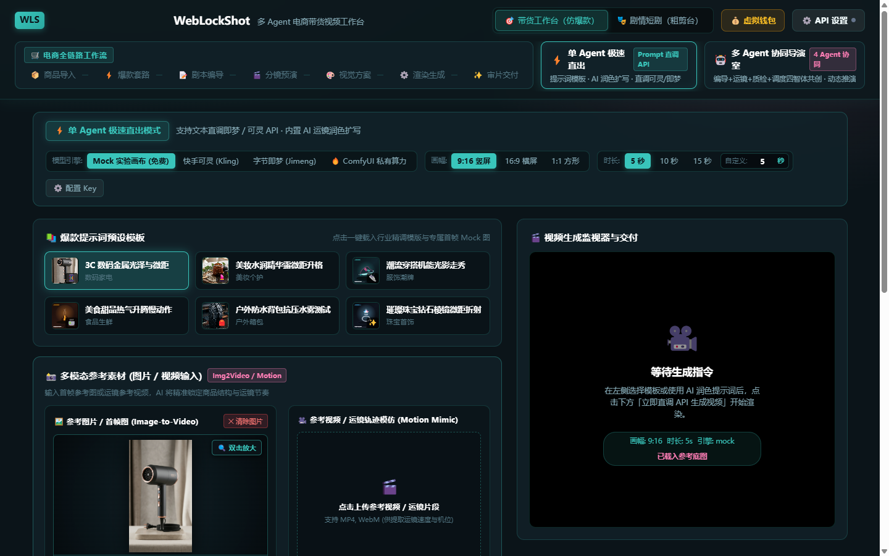
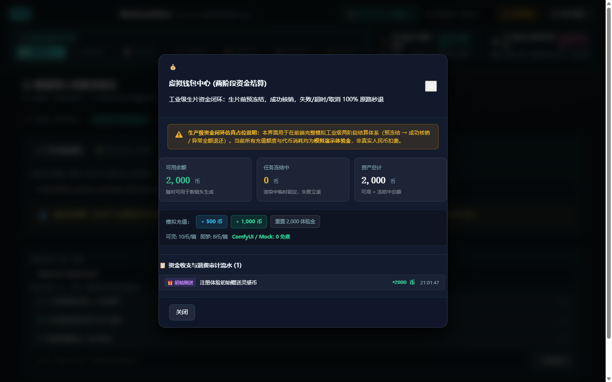

# WebLockShot 完整使用指南与工业化实战手册

> 本指南旨在帮助电商卖家、带货主播、编导创作者及 AI 视频开发人员，快速掌握 WebLockShot 的核心链路、双工作室工作流、私有化 ComfyUI 算力集成，以及剪映 / CapCut 自动化草稿对齐出片。

---

## 目录
- [（序）介绍与定位](#序介绍与定位)
- [（一）快速上手：免安装在线版 vs 团队私有部署](#一快速上手免安装在线版-vs-团队私有部署)
- [（二）电商全链路六步爆款工作流](#二电商全链路六步爆款工作流)
  - [Step 0：商品信息多模态导入](#step-0商品信息多模态导入)
  - [Step 1：5 大爆款结构与黄金 3 秒钩子选择](#step-15-大爆款结构与黄金-3-秒钩子选择)
  - [Step 2：双 Agent 剧本编导与对立面评审](#step-2双-agent-剧本编导与对立面评审)
  - [Step 3：9:16 GSAP 动态分镜视觉预演](#step-3916-gsap-动态分镜视觉预演)
  - [Step 4：视觉提示词工程编译](#step-4视觉提示词工程编译)
  - [Step 5：串行任务队列与神经渲染调度](#step-5串行任务队列与神经渲染调度)
  - [Step 6：连续审片、TTS 口播与剪映草稿对齐导出](#step-6连续审片tts-口播与剪映草稿对齐导出)
- [（三）双独立工作室模式](#三双独立工作室模式)
  - [模式 A：单 Agent 极速直出模式](#模式-a单-agent-极速直出模式)
  - [模式 B：多 Agent 协同编导研讨室](#模式-b多-agent-协同编导研讨室)
- [（四）视频供应商配置与 ComfyUI 自建私有算力指南](#四视频供应商配置与-comfyui-自建私有算力指南)
  - [1. 快手可灵 (Kling) API 直连](#1-快手可灵-kling-api-直连)
  - [2. 字节即梦 (Jimeng) API 直连](#2-字节即梦-jimeng-api-直连)
  - [3. ComfyUI 本地/局域网私有 GPU 算力集群（Wan 2.1 / CogVideoX）](#3-comfyui-本地局域网私有-gpu-算力集群wan-21--cogvideox)
- [（五）剪映 / CapCut 电脑版草稿工程导入与声画自动对齐实操](#五剪映--capcut-电脑版草稿工程导入与声画自动对齐实操)
- [（六）工业级可靠性体系：幂等防抖、状态机与两阶段钱包闭环](#六工业级可靠性体系幂等防抖状态机与两阶段钱包闭环)
- [（七）常见问题与避坑指南（FAQ）](#七常见问题与避坑指南faq)

---

## （序）介绍与定位

**WebLockShot** 是一款面向带货短视频与电商视觉创作者的 **多 Agent 闭环短视频生成平台**。

过去创作一条符合平台推流机制的电商爆款短视频，通常面临如下痛点：
1. **创意开销大**：依赖人工编写脚本，不懂前 3 秒黄金完播率套路；
2. **多工具断层**：找商品图、打磨 Midjourney/Sora 提示词、可灵网页生片、下载再拖入剪映手动拼接剪辑，全流程分散低效；
3. **接口资费昂贵且无防重保障**：云端视频 API 动辄几毛到几块钱一次，网络重试或连击经常造成重复扣费；
4. **声画割裂**：生成的视频片段长度固定，与配音解说字幕时长不匹配，人工拉伸音频费时费力。

WebLockShot 实现了全链路整合突破：**从商品卖点输入、爆款结构套用、双 Agent 剧本研讨、9:16 动态预演、自建 ComfyUI / 商业 API 渲染生成，到剪映草稿工程声画字三轨微秒自动对齐，全流程浏览器内闭环！**

### 传统工作流 vs WebLockShot 核心特性对比

| 环节 / 能力 | 传统人工制作模式 | 一般套壳 AI 工具 | WebLockShot 工作台 |
| :--- | :--- | :--- | :--- |
| **爆款规律把控** | 编导凭个人感觉拼凑 | 单一文本粗糙扩写 | **内置 5 大爆款结构套路库 + 黄金 3 秒强对抗钩子库**（Zod 强约束） |
| **脚本编导质量** | 单人盲写，缺乏审校 | 直接输出一段长文本 | **ScriptWriter + ScriptCritic 双智体剧本推演与严苛批判打分** |
| **生片前可控预演** | 脑内想象或黑屏等待 | 无法预演，直接开盲盒 | **9:16 GSAP 动态分镜舞台，毫秒级模拟镜头运镜与转场节奏** |
| **渲染算力支持** | 仅能在特定官方网页手动点 | 仅对接 1 家闭源云端 API | **四擎并行**：快手可灵、字节即梦、**ComfyUI 私有显卡 (Wan 2.1)**、Mock 实验画布 |
| **出片成本** | 商业 API 接口费昂贵 | 充值代币高溢价抽成 | **0 接口费自由**：直连本地 RTX 4090 / A100 ComfyUI，边际成本趋向于 0 |
| **防重与资金安全** | 连击重复扣费，失败不管 | 失败扣点不予返还 | **工业级两阶段事务钱包**（预冻结 → 成功核销 / 失败回滚）+ SHA-256 幂等防抖 |
| **剪辑工程交付** | 人工逐轨拖拽、切片对齐 | 仅提供独立 MP4 下载 | **剪映 / CapCut 草稿工程直出**：视频轨 + 旁白轨 + 花字字幕轨微秒级自动化对齐 |

---

## （一）快速上手：免安装在线版 vs 团队私有部署

### 1. 纯前端零配置开箱体验
- 在线访问：https://qwqcool.github.io/WebLockShot/
- **零服务端依赖、免注册登录**：所有密钥安全保存在浏览器本地 `sessionStorage`，绝不上传任何第三方服务器，保护企业数据隐私。
- **免 Key 畅玩**：内置 Mock 实时画布录制引擎与 0-Key AI 规则模板引擎，无需充值即可体验完整生产链路。

### 2. 本地自建与二次开发
适合拥有本地高配 GPU（RTX 3090/4090/A100）或需内网部署的团队：
```bash
# 克隆仓库
git clone https://github.com/QWQcool/WebLockShot.git
cd WebLockShot

# 安装依赖
npm install

# 启动本地开发服务 (支持 ComfyUI 自动反向代理)
npm run dev
```
启动后在浏览器打开 `http://localhost:5173` 即可进入工作台。

---

## （二）电商全链路六步爆款工作流


点击顶部导航的 **「🛒 电商全链路工作流」**，即可按科学工业化步骤执行生成。

### Step 0：商品信息多模态导入
- **链接导入**：输入电商主图链接，系统如实归档并引导填写核心差异化卖点；
- **图片导入**：支持上传高清商品白底图或透底图，内置 9 款 3C、美妆、服饰大厂级 Mock 预设图一键选用；
- **参考视频导入**：支持上传本地爆款对标视频片段，内置 Canvas 自动抽帧引擎。

### Step 1：5 大爆款结构与黄金 3 秒钩子选择
针对短视频平台推流算法，内置经百万播放验证的 5 套 6 镜带货套路：
1. **痛点开场型 (Pain-Solution)**：反常识开场 → 痛点共鸣放大 → 产品破局 → 核心功能微距 → 信任凭证背书 → 强引导限时下单；
2. **效果反差型 (Contrast-Shock)**：震撼对比 → 揭秘关键机理 → 深度实测 → 体验升级 → 资质打消顾虑 → 行动号召；
3. **沉浸开箱型 (Sensory-Unboxing)**：视听微距开箱 → 材质触感细节 → 交互仪式感 → 场景融入 → 性价比锚点 → 福利促单；
4. **短剧场景植入型 (Drama-Insert)**：人物生活矛盾冲突 → 戏剧化窘境 → 救场神器亮相 → 危机化解 → 情感共鸣 → 购买指引；
5. **价格锚点型 (Price-Anchor)**：大牌天价对比 → 打破暴利黑幕 → 极致做工对标 → 溯源源头成本 → 超值特惠释放 → 锁单催促。

### Step 2：双 Agent 剧本编导与对立面评审
- **编导智体 (ScriptWriter)**：结合商品卖点与所选爆款套路，自动创作符合竖屏短视频传播节奏的 6 镜分镜台词与画面描述。
- **质检智体 (ScriptCritic)**：化身挑剔的平台质检员，从「3 秒停留率、卖点可视化、完播节奏、合规风险」4 个维度严苛打分（0~100 分），并提出具体的剧本修改诊断建议。

### Step 3：9:16 GSAP 动态分镜视觉预演
- 在向昂贵算力派发任务前，WebLockShot 的 `sell-stage` 动态舞台会基于 GSAP 动画引擎进行 9:16 全真视觉模拟；
- 能够直观预览每个镜头的景别（特写、中景、远景）、推拉摇移运镜动势、卖点文字弹幕浮现节奏。

### Step 4：视觉提示词工程编译
- 系统自动将分镜剧本编译为高精度中英文双语视觉提示词（Positive Prompt & Negative Prompt）；
- 自动规范画幅（9:16）、镜头秒数（3~6 秒）、渲染参数（8K、光影质感、运镜轨迹与物理防畸变约束）。

### Step 5：串行任务队列与神经渲染调度
- 单机串行任务调度引擎自动调度各镜头任务；
- 支持快手可灵、字节即梦、**ComfyUI 私有集群** 或 Mock 本地录制出片；
- 具备实时任务排队进度监控、单镜头独立失败重试与错误精准上报。

### Step 6：连续审片、TTS 口播与剪映草稿对齐导出
- 6 镜视频无缝连播审片播放器，支持全屏预览与单镜头逐一审阅；
- **智能 TTS 配音**：内置语速自适应算法，自动根据镜头秒数缩放台词语速，确保台词在镜头结束前精准收尾；
- **剪映草稿工程直出**：一键导出对齐好的 `draft_content.json`。

---

## （三）双独立工作室模式

除了标准的六步全链路外，顶部工具栏还提供针对快速单挑和复杂编导的双工作室：

### 模式 A：单 Agent 极速直出模式



适合单镜头快速实验与电商图生视频（Image-to-Video）：
- **精选灵感库**：内置 3C 数码金属光泽、美妆水润精华露微距、潮流穿搭光影等高转化提示词预设；
- **AI 智能运镜润色**：输入简略构思（如“吹风机快速吹干水滴”），AI 自动扩写为运镜、布光、景深齐全的电影级 Prompt；
- **多模态参考素材面板**：
  - **参考图片**：支持拖拽上传本地图，支持点击九宫格快速载入高清 Mock 图，支持**双击灯箱无损放大预览**；
  - **参考视频**：支持上传本地运镜视频片段，提取动作参考（Motion Mimic）。
- **时长自由调节**：支持 5s、10s、15s 预设切换，或在微调框中键入 1~60 秒自定义时长。

### 模式 B：多 Agent 协同编导研讨室


适合高定短片与复杂多镜头影视级创作：
- **4 Agent 协同共创推演**：
  1. 🎬 **导演 Agent (Director)**：负责整体视觉调性、节奏节奏把控与场景构建；
  2. 🎥 **运镜 Agent (Cinematographer)**：设计精妙机位走位、焦段切换（85mm/100mm微距）与动态打光；
  3. ⚖️ **质检 Agent (Critic)**：严查画质连贯性、商品特征变形与过饱和瑕疵；
  4. ⚡ **调度 Agent (Dispatcher)**：综合 3 方评审意见，合成终极提示词并派发至渲染引擎。
- 动态推演过程全可视，支持多轮协商打磨。

---

## （四）视频供应商配置与 ComfyUI 自建私有算力指南


点击右上角 **「⚙️ API 设置」** 即可完成各生成渠道的配置。

### 1. 快手可灵 (Kling) API 直连
- 申请快手可灵官方开发者平台 API 密钥（Access Key ID 与 Secret Key）；
- 填入对应输入框并选择首选生片时长；
- 生成计费：在虚拟钱包中约 10 灵感币/镜头。

### 2. 字节即梦 (Jimeng) API 直连
- 填入即梦开放平台 API Key 与端点地址；
- 生成计费：在虚拟钱包中约 8 灵感币/镜头。

### 3. ComfyUI 本地/局域网私有 GPU 算力集群（Wan 2.1 / CogVideoX）
这是 WebLockShot 最强力的工业化亮点——**连接您自己的显卡算力，享有 0 API 费用无限畅做短视频！**

#### 步骤 1：本地启动 ComfyUI
确保您的 ComfyUI 支持外部或局域网访问，启动命令行必须加上 `--listen` 参数：
```bash
python main.py --listen 127.0.0.1 --port 8188
```
*(如部署在局域网 GPU 服务器，可使用 `--listen 0.0.0.0`)*

#### 步骤 2：推荐模型依赖
- **阿里 Wan 2.1 (WanVideo I2V)**：当前开源图生视频领域极度出色的模型，支持 14B / 1.3B 参数；
- **智谱 CogVideoX-5B**：擅长大幅度动作动力学与电影感光影；
- **Stability SVD-XT**：轻量化微距商品展示。

#### 步骤 3：在 WebLockShot 中绑定并一键探测
1. 打开右上角 **「⚙️ API 设置」**；
2. 视频提供商选择 **「ComfyUI 自建/私有算力 (0接口费)」**；
3. 输入实例地址（本地通常保持默认 `http://127.0.0.1:8188` 即可，Vite 会自动通过 `/api/comfyui` 反代穿透跨域）；
4. 点击 **「🔍 测试连接 (Ping GPU)」** 按钮；
5. 系统将调用 `/system_stats` 接口，瞬间返回显卡型号（例如 `NVIDIA GeForce RTX 4090`）以及当前剩余可用显存（VRAM），确认连通即可畅享无成本生片！

---

## （五）剪映 / CapCut 电脑版草稿工程导入与声画自动对齐实操

在全链路最后一步 **「✨ 审片交付」**，点击 **「📥 导出剪映电脑版草稿工程 (draft_content.json)」**：

### 剪映草稿对齐原理
WebLockShot 导出的 `draft_content.json` 是标准的 CapCut/剪映工程格式：
1. **三轨微秒对齐 (1s = 1,000,000us)**：
   - `track_video` (视频主轨)：6 镜视频无缝顺排；
   - `track_audio` (旁白配音轨)：每个镜头的配音与视频起始点、终止点微秒严密吻合；
   - `track_text` (花字字幕轨)：带货爆款花字，第 1 镜黄金钩子预设黄色高亮与更大字号。
2. **自适应防黑帧**：精确计算 `source_timerange` 与 `target_timerange`，杜绝任何黑帧或音频爆音重叠。

### 如何导入剪映电脑版：
1. 打开您电脑上的剪映 / CapCut 电脑版，新建一个空白草稿并起名（例如 `吹风机带货`）；
2. 找到剪映本地草稿保存目录：
   - **Windows**：`C:\Users\<用户名>\AppData\Local\JianyingPro\User Data\Projects\com.lveditor.draft\`
   - **macOS**：`~/Movies/JianyingPro/User Data/Projects/com.lveditor.draft/`
3. 进入对应工程名字的文件夹，将 WebLockShot 下载的 `draft_content.json` 替换原有文件；
4. 重新在剪映中打开该项目，所有分镜视频、配音解说与爆款字幕已在时间线上精确对齐就绪，直接导出高清成片！

---

## （六）工业级可靠性体系：幂等防抖、状态机与两阶段钱包闭环

为了支撑商业生产环境的稳定性，WebLockShot 构筑了三重安全防护网：

### 1. 任务幂等性与防连击锁 (Idempotency & Debounce)
- **SHA-256 结构化意图签名**：根据 `(intent, provider, prompt, duration, shotId)` 计算唯一幂等指纹；
- **In-flight 互斥锁**：任务在后台处理期间，拦截一切重复连击，并在界面给出倒计时提示，防止并发风暴。

### 2. 状态机流转与边界容错 (FSM & Circuit Breaker)
- **状态转移守卫**：任务严格按照 `IDLE` → `VALIDATING` → `FROZEN` → `SUBMITTING` → `RUNNING` → `SUCCEEDED / FAILED / REFUNDED` 流转，阻断非法状态篡改；
- **自动熔断器 (Circuit Breaker)**：若某一云端 API 连续出现 3 次 5xx 或网络异常，熔断器自动跳闸保护，暂时阻断同渠道任务并建议切换至 ComfyUI / Mock 模式，30 秒后自动半开探测。

### 3. 虚拟钱包两阶段提交事务 (Two-Phase Commit Wallet)



- 顶部导航常驻 **「💰 虚拟钱包」**；
- **阶段 1：预冻结 (Freeze)**：点击生成时，若余额充足，将预估费用移入「任务冻结中」，锁定资金防并发超支；
- **阶段 2A：成功核销 (Settle)**：出片成功后正式划扣冻结款项；
- **阶段 2B：失败回滚 (Refund)**：一旦发生网络中断、接口超时、生成异常或用户取消，**冻结款项 100% 毫秒级全额退回可用余额**；
- 具备完整的资金交易收支流水审计明细，支持一键模拟充值与重置体验金。

---

## （七）常见问题与避坑指南（FAQ）

#### Q1：调用本地 ComfyUI 时提示网络错误或连接超时？
- **排查 A**：请确认启动 ComfyUI 时是否添加了 `--listen` 参数（必须为 `python main.py --listen 127.0.0.1 --port 8188`）；
- **排查 B**：WebLockShot 在开发环境下通过 Vite 内置反向代理 `/api/comfyui` 穿透跨域，请确认通过 `http://localhost:5173` 访问工作台，而不是直接双击打开本地 HTML 文件。

#### Q2：为什么点击生成按钮提示“钱包可用余额不足”？
- WebLockShot 引入了工业级资金防透支机制。点击顶部导航栏的 **「💰 虚拟钱包」**，点击 **「+ 1,000 币」** 模拟充值或 **「重置 2,000 体验金」**，即可立即恢复生成。若使用 ComfyUI 或 Mock 模式，资费为 0，永不扣费。

#### Q3：如果某个镜头生成的画面不满意怎么办？
- 在第 6 步「审片交付」阶段，无需全部重跑！针对不满意的单个镜头，点击右侧的 **「🔄 局部重生成」**，系统将仅对该单镜重新调度生成，其余满意的镜头保持不变，极大节约算力与时间。

#### Q4：导出的剪映草稿打开后素材显示离线？
- 剪映草稿中记录了各视频素材的本地路径或网络 URL。若为本地录制的 Blob URL，请将下载的视频素材文件保存在剪映草稿同级目录下，剪映将自动完成重链接。

---

*WebLockShot 致力于为每一位电商创作者打造顺滑、可信、低成本的 AI 短视频工业化流水线。*
