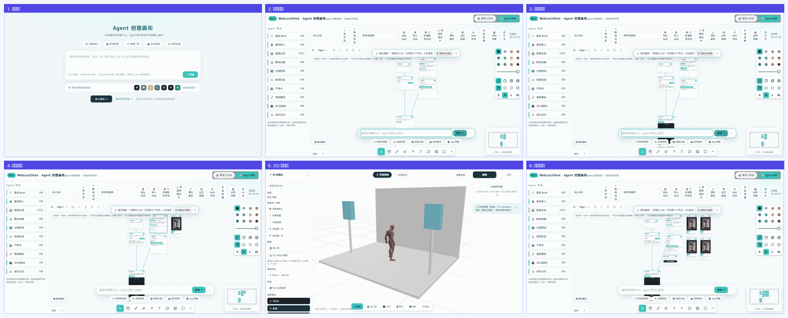
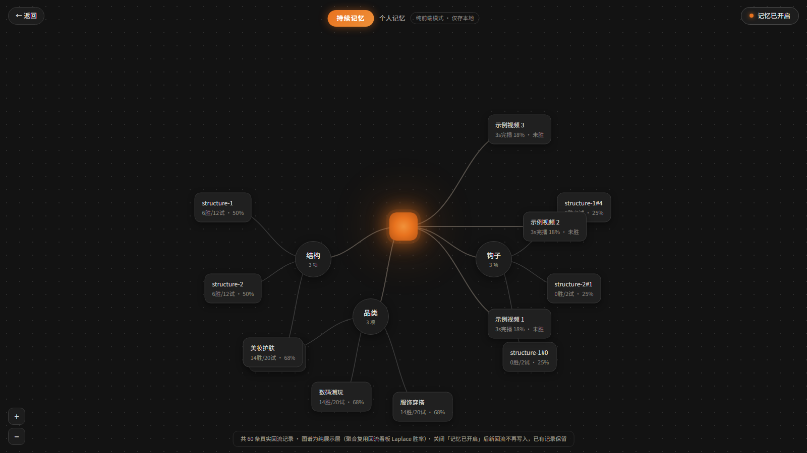
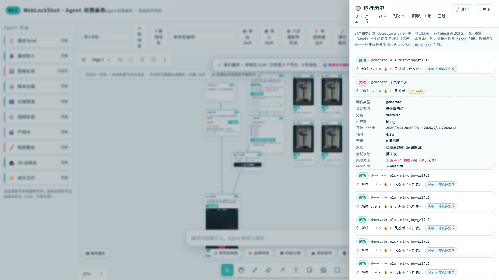

<div class="cover">
  <div class="kicker">项目能力展示 · Agent 创意画布</div>
  <h1>WebLockShot · 一句话到成片工程</h1>
  <p class="lead">在浏览器里跑完的创意生产工作台：在无限画布上用一句话布置 Agent 节点，
  从脚本一路做到<b>可直接导入剪映继续剪辑</b>的成片工程。</p>
  <div class="cover-meta">
    <span>在线体验：<b>https://qwqcool.github.io/WebLockShot/</b></span>
    <span>技术栈：React 19 · TypeScript 6 · Vite 8 · tldraw 5 · three.js · GSAP</span>
    <span>形态：纯静态可部署 · 免安装 · 免 API Key 即可跑通全链路（演示引擎）</span>
  </div>
</div>

打开链接即可完整体验，**不需要注册、不需要配置任何 Key**：对话栏说一句话，画布上会自动长出一条
Agent 节点链路；点几下就能拿到脚本、9:16 分镜预演、逐镜出片，最后打包出一份**能导入剪映的工程文件**。

<div class="stats">
  <div class="stat"><b>9</b><span>类 Agent 节点</span></div>
  <div class="stat"><b>6</b><span>个生成引擎契约</span></div>
  <div class="stat"><b>45</b><span>个 3D 动画片段</span></div>
  <div class="stat"><b>17</b><span>步实机 E2E</span></div>
  <div class="stat"><b>475</b><span>项自动化测试</span></div>
  <div class="stat"><b>50k+</b><span>行自有代码</span></div>
</div>


## 一、30 秒演示：一句话 → 成片工程

下面这条分镜条由**真实操作录屏**（约 30 秒）抽取关键帧合成，顺序为从左到右、从上到下：



六个关键节点分别是：

1. **开场层**：五类创作场景 tab + 大输入卡，首访叠加引导；
2. **节点拓扑**：一句话（或点场景模板）后自动布置节点与连线，可一键整批撤销；
3. **生成脚本**：ScriptWriter 产出脚本，Critic 给出对立面评审与评分；
4. **分镜预演**：拆成 6 镜，画布内嵌 9:16 GSAP 动态预演，可逐镜播放；
5. **3D 运镜台**：摆角色 / 调机位 / 切场景预设，全程本地渲染、**0 灵感币**；
6. **成片交付**：逐镜出片挂成产物卡，一键打包**剪映草稿 zip**。

> 演示默认走**演示引擎**（不耗积分、可离线跑通全链路），界面会如实标注「演示编排 · 非真实 LLM」。
> 配置引擎 Key 后即切换为真实生成。

## 二、功能地图

### 2.1 九类 Agent 节点

| 节点 | 作用 | 状态 |
|---|---|---|
| 🗒️ 需求 Brief | 一句话需求 → 结构化 Brief（给谁看 / 突出什么） | 可用 |
| 📥 素材导入 | 商品图 / 参考图 / 视频统一入口，本地读取直接产出图片产物卡 | 可用 |
| 📝 脚本创编 | ScriptWriter + Critic 双智体：口播 / 剧情台词 / 品牌叙事 | 可用 |
| 🎞️ 分镜预演 | 连入 script 后生成 6 镜，内嵌 9:16 GSAP 预演（本地预演 · 非成片） | 可用 |
| ⚙️ 视频生成 | 逐镜生成，ExecutorEngine 串行队列 + 钱包两阶段事务 | 可用 |
| 🎬 产物卡 | 单镜出片产物（大资产入 IndexedDB），可连线送入成片交付 | 可用 |
| 🖌️ 局部重绘 | 产物卡 → 笔刷 / 框选涂抹 → inpaint 重绘，产物版本堆叠可回退 | 可用 |
| 🎥 3D 运镜台 | 摆角色 / 调机位 / 录关键帧，接单镜直出或自由镜数分镜 | 可用 |
| ✨ 成片交付 | 打包剪映草稿三轨对齐工程 + 素材 zip | 可用 |
| 🖼️ 图像生成 | 文生图 / 图生图 | 规划中（界面如实标注） |

### 2.2 画布与协作能力

- **无限画布**：拖拽缩放、框选、连线、撤销重做、导入导出（tldraw 5 基座 + 自研浅色换肤）；
- **多画布项目**：多项目独立存储，切换不串数据；老单画布文档**零丢失迁移**；
- **小地图**：右下角 Canvas2D 自绘，点击 / 拖动导航；
- **Skill 工作流包**：框选 ≥2 个节点即可**导出为 Skill 包**（节点拓扑 + 参数槽位 + 输入输出声明，
  产物与大资产自动剥离），导入即重建节点组、只填新输入；内置「六步爆款带货流」「单图快速出片」两个官方 Skill；
- **记忆系统**：按结构 / 钩子 / 品类胜率（Laplace 聚合）为脚本采样加权，并提供可视化记忆图谱（见第五章）；
- **连接器面板**：7 个推荐连接器卡片位 + 自定义连接器，协议层状态如实标注；
- **中英双语**：顶栏一键切换并持久化，默认中文零回归。

## 三、节点拓扑与编排（重点）

这是整个画布的骨架：**一句话进来，拓扑自己长出来**。

- 对话栏输入一句话（或点「带货短视频 / 品牌视觉 / 短剧分镜 / 游戏宣传 / App 界面」场景模板，
  或从「创作场景画廊」的六类场景卡片进入）；
- 系统按场景路由布置节点与连线，**可一键整批撤销**；
- 节点之间的连线带**类型契约校验**：非法连线会被拒绝并给出提示条，避免「连了但跑不通」；
- 每个节点卡片显示可用性徽标（就绪 / 未实现 / 规划中），**不伪造可用状态**；
- 连线即数据流：上游产出自动出现在下游节点的输入区（例如分镜节点会显示来自脚本节点的 logline）。


## 四、3D 运镜台（重点）

同类创意画布大多止步于 2D 出图；这里内置了一套**本地 3D 预演台**——全程浏览器内 three.js 渲染，
**不消耗任何积分、不依赖云端 GPU**：

- **内置 CC0 素体**：Quaternius Universal Animation Library，模型内嵌 **45 个真实动画片段**（实测值），
  其中 8 个做成动作预设（待机 / 走路 / 慢跑 / 冲刺 / 跳舞 / 坐姿 / 跳跃 / 说话）；
- **六套程序化场景预设**：商品台 / 影棚 / 客厅 / 卧室 / 户外台阶 / 展台，一键切换；
- **多机位管理**：机位可增删、可切换预览，导演视角参数可提取；
- **关键帧轨迹**：录关键帧驱动运镜，支持播放预览；
- **首 / 尾帧导出**：把摆好的画面直接接给「视频生成」节点做单镜直出，或接给「分镜预演」出自由镜数分镜；
- **对象树与属性面板**：位置 / 旋转 / 缩放 / 配色可调，素体姿势可选。


## 五、记忆图谱（重点）

记忆系统把「历史回流数据」变成**可回看的图结构**，并反哺脚本生成：

- 记录来源：真实回流记录（3 秒完播率 / 完播率 / 转化），可按结构 / 钩子 / 品类聚合；
- 聚合方式：**Laplace 平滑**计算胜率，避免小样本极端值误导；
- 反哺链路：ScriptWriter 采样时按真实胜率加权——**数据真的会影响生成结果**，不是摆设面板；
- 可视化：暗色全屏图谱视图，节点可拖拽、可点击查看明细；
- **空态不摆样例数据**：没有记录时如实显示空态（下图是写入演示数据后的状态，图注已注明来源）。



## 六、其余能力

### 6.1 Skill 市场

官方内置 + 已安装统一管理：安装 / 启停 / 卸载 / 发布到本地。Skill 让「一次编排」变成**可复用的工作流资产**。


### 6.2 创作场景画廊

六类创作场景卡片，点击可预填对话栏或一键编排，复用同一套编排路由。


### 6.3 连接器面板

7 个推荐连接器卡片位 + 自定义添加；协议层状态如实标注（纯前端模式 / 仅接口）。


### 6.4 中英双语

顶栏「🌐 中文 / EN」一键切换并持久化，英文界面同样完整可用（真实 i18n 字典，非截图贴图）。


### 6.5 剪映 / CapCut 草稿交付

交付的不是「一段 mp4」，而是**可以继续剪的工程**：视频轨 + 旁白音轨 + 花字字幕轨**微秒级对齐**的
`draft_content.json` 与素材一起打包成 zip，解压放进剪映草稿目录即可打开；伴生服务在线时还可一键落盘。

### 6.6 生成引擎与钱包

- **6 个引擎契约**：Mock / 快手可灵 / 字节即梦 / ComfyUI 私有算力 / Runway / Luma；
- **灵感币两阶段结算**：出片前预冻结 → 成功核销 / 异常全额退款（含幂等与 30 分钟 TTL 孤儿冻结回收）；
  画布与工作台共用同一条钱包管线，费用在界面上透明可见。

### 6.7 运行历史（可审计）

每次节点执行落一条记录（由执行器**单一收口**写入，滚动保留最近 200 条）：**状态 / 耗时 /
费用（灵感币）/ 是否退款 / 失败原因**，可展开看关联节点、分镜、供应商、尝试次数与输出引用
（优先展示节点内持久化的 `idbref://`）。与虚拟钱包打通是本项目的差异化信息——**这一次花了多少、
退了没有，一目了然**。



## 七、技术实现与质量门禁

### 7.1 分层结构

| 层 | 职责 | 关键模块 |
|---|---|---|
| 入口层 | 开场层 / 对话栏 / 场景模板 | 开场引导、对话栏、场景模板 chips |
| 编排层 | 一句话 → 节点拓扑 | 场景路由 + LLM 编排（可降级演示编排） |
| 画布层 | 无限画布 + 9 类节点 | tldraw 5 + 自研 shapeUtils、CanvasDoc 契约、localStorage 持久化 + 多标签同步 |
| 执行层 | 串行队列 + 结算 | ExecutorEngine、灵感币钱包（两阶段事务） |
| 能力层 | 脚本 / 分镜 / 出片 / 重绘 / 3D | ScriptWriter + Critic、6 引擎契约、three.js 运镜台 |
| 交付层 | 产物卡 + 剪映工程 | 剪映草稿三轨对齐 + 零依赖 zip |
| 支撑层 | 本地优先 / 可选伴生服务 | IndexedDB 大资产、TTS / ffmpeg / sqlite / MCP |

### 7.2 代码规模（实测）

| 部分 | 文件数 | 行数 |
|---|---|---|
| 前端 TS/TSX（`src/`） | 185 | 33,899 |
| 样式（`src/**/*.css`） | 8 | 8,244 |
| 伴生服务（`server/`） | 16 | 5,187 |
| 测试与工具脚本（`scripts/`） | 15 | 3,315 |

### 7.3 自动化验证

| 套件 | 命令 | 当前结果 |
|---|---|---|
| 单元测试（node） | `npm test` | **449 项，0 失败** |
| 组件测试（vitest） | `npm run test:ui` | **26 项，0 失败** |
| 画布 E2E（真实鼠标路径） | `npm run e2e` | **17/17** |
| 移动端窄屏断言（双视口） | `npm run e2e:mobile` | **15/15** |
| 子路径部署回归 | `npm run e2e:basepath` | **全过** |
| 生产模式回归 | `npm run e2e:prod` | **全过** |
| 降级 / 迁移矩阵 | `npm run degrade` | **6/6** |
| 跨浏览器 + a11y | `npm run a11y` | chromium / webkit 双引擎，axe 严重项 **0** |
| 性能基准 | `npm run perf` | 见 `docs/perf.md` |

## 八、60 秒上手

```bash
# 在线直接体验（免安装、免 Key）
https://qwqcool.github.io/WebLockShot/

# 本地跑起来
git clone https://github.com/QWQcool/WebLockShot.git
cd WebLockShot && npm install
npm run dev            # 打开 http://localhost:5173

# 质量门禁（可自行复现第七章的全部数字）
npm test               # 单元测试
npm run e2e            # 17 步实机 E2E
```

<div class="endnote">
<b>一句话总结</b>：一句话进、成片工程出——中间是 9 类可编排节点、一套本地 3D 预演台、
一套会反哺生成的真实记忆系统，以及一条可继续剪辑的交付链路。
</div>
